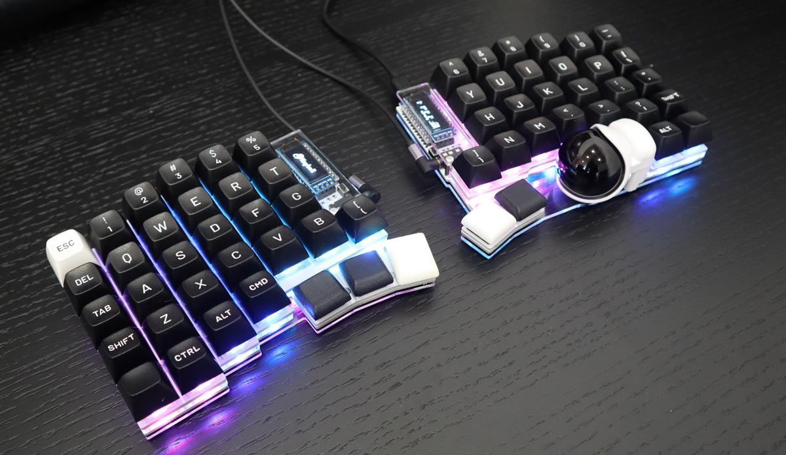

# Keyball Series

Keyball series is keyboard family which have 100% track ball.

Keyboards in the family are:

* Available
    * Keyball39: split + 39 keys + a track ball
    * Keyball44: split + 44 keys + a track ball
    * Keyball61: split + 61 keys + a track ball
* Unavailable
    * Keyball46 (first one!)
    * One47

## Where to Buy

|Keyboard   |Shirogane Lab / 白銀ラボ                                   |Yushakobo / 遊舎工房                       |
|-----------|-------------------------------------------|-----------------------------------------------------------|
|Keyball39  |<https://shiroganelab.com/products/keyball39> |<https://shop.yushakobo.jp/products/5357>  |
|Keyball44  |<https://shiroganelab.com/products/keyball44> |<https://shop.yushakobo.jp/products/8337>  |
|Keyball61  |<https://shiroganelab.com/products/keyball61> |<https://shop.yushakobo.jp/products/5358>  |

## Build Guide

*   Keyball39:
    [English/英語](/keyball39/doc/rev1/buildguide_en.md),
    [日本語/Japanese](./keyball39/doc/rev1/buildguide_jp.md)
*   Keyball44:
    [English/英語](./keyball44/doc/rev1/buildguide_en.md),
    [日本語/Japanese](./keyball44/doc/rev1/buildguide_jp.md)
*   Keyball61:
    [English/英語](./keyball61/doc/rev1/buildguide_en.md),
    [日本語/Japanese](./keyball61/doc/rev1/buildguide_jp.md)

## Firmware

See [document for firmware source code](./qmk_firmware/keyboards/keyball/readme.md).

### Pre-compiled Firmwares

(TO BE DOCUMENTED)
