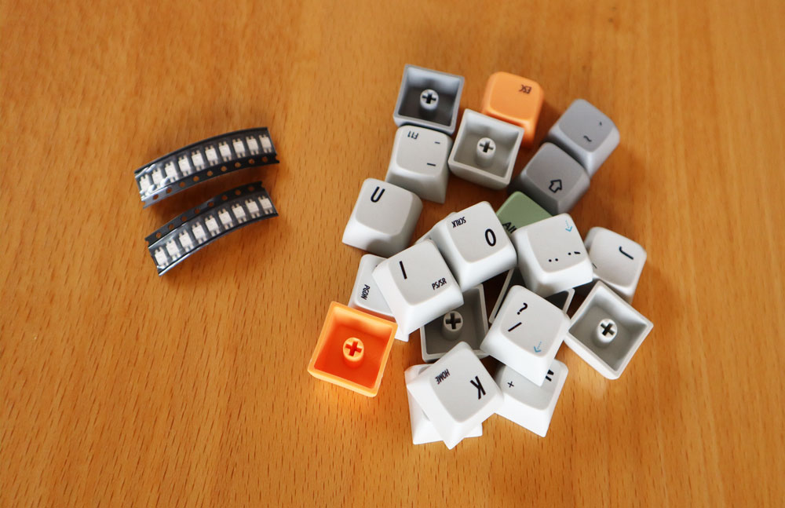
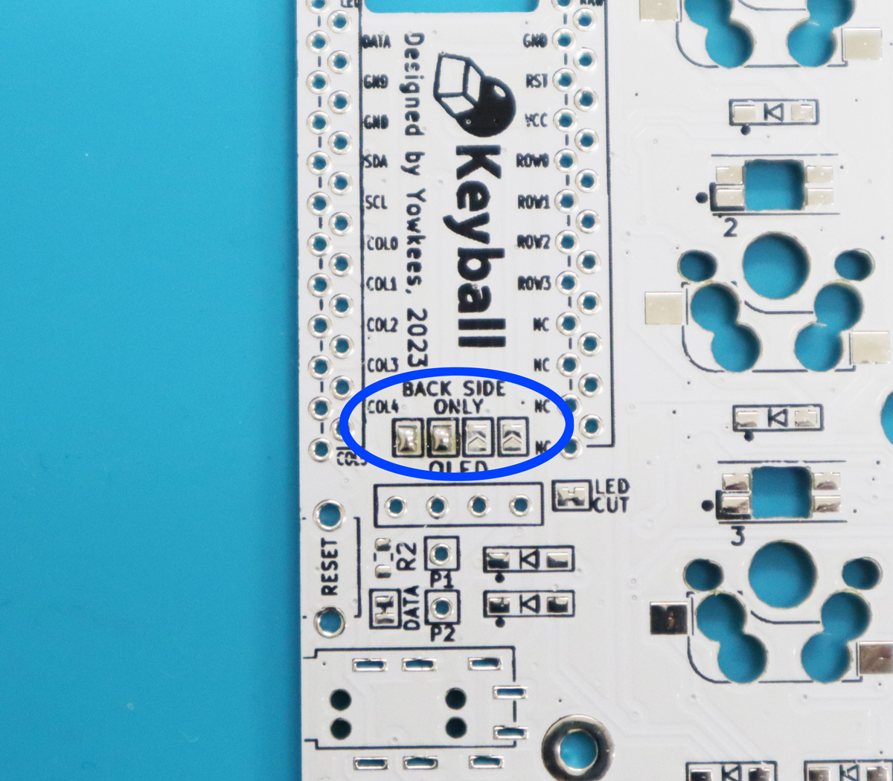
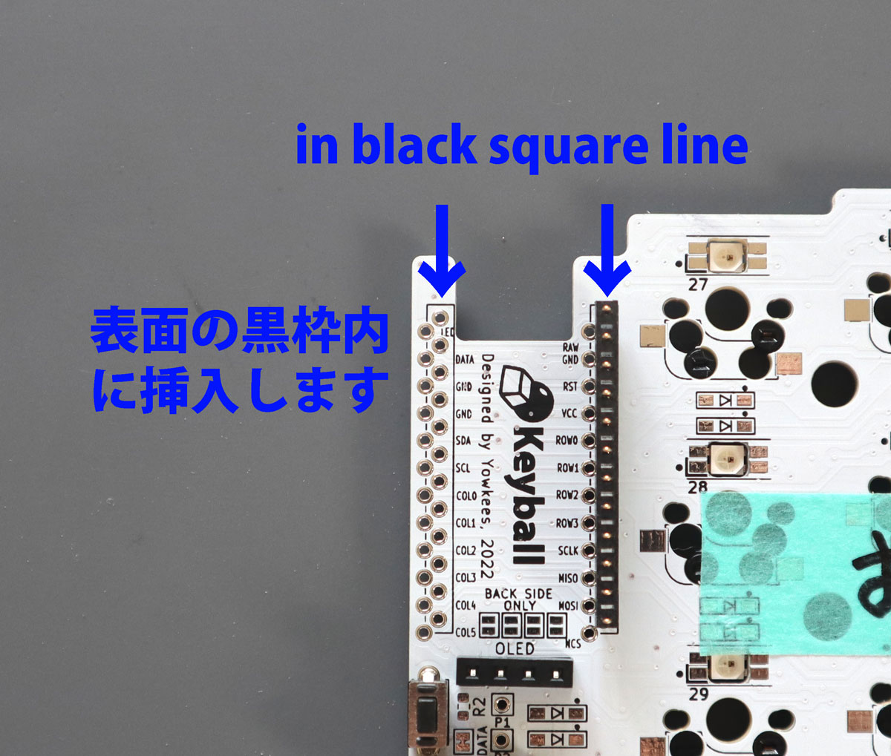

# Build Guide for Keyball44

This guide provides detailed instructions for assembling the Keyball44.  
※This guide uses photos of the white PCB version of Keyball44, but the same procedure applies to the black PCB version.  
Sections that require special attention for black PCB sets are marked with ⚫️ at the beginning.

**日本語版のKeyball44ビルドガイドは[こちら](buildguide_jp2.md)です。**
  

## 【Table of Contents】

> **Preparation**
 - [1. Parts Check](#anchor1)
   - [1-1. Kit Contents](#anchor11)
   - [1-2. Parts You Need to Prepare Yourself Before Assembly](#anchor1-2)
   - [1-3. Parts and Options That Can Be Installed After Assembly](#anchor1-3)
 - [2. Preparation](#anchor2)
   - [2-1. Required Tools](#anchor2-1)
   - [2-2. Firmware](#anchor2-2)

> **Implementation**
 - [3. Implementation](#anchor4)
   - [3-1. Before Soldering](#anchor3-1)
   - [3-2. Installing Diodes](#anchor3-2)
   - [3-3. Soldering LEDs (Optional)](#anchor3-8)
   - [3-4. Soldering Key Sockets](#anchor3-3)
   - [3-5. Soldering Jumpers](#anchor3-4)
   - [3-6. TRRS Socket, Tactile Switch, and 4-pin Socket](#anchor3-5)
   - [3-7. Soldering ProMicro](#anchor3-6)
   - [3-8. ProMicro Programming and Operation Check](#anchor3-7)
 - [4. Assembling the Trackball Reading Board](#anchor4)
   - [4-1. Soldering the Sensor](#anchor4-1)
   - [4-2. Soldering the L-shaped Connector](#anchor4-2)
 - [5. Cutting the Top Plate (Optional)](#anchor5)

> **Assembly**
 - [6. Assembly](#anchor6)
   - [6-1. Installing the Protection Plate](#anchor6-1)
   - [6-2. Assembling the Top Plate](#anchor6-2)
   - [6-3. Assembling the Bottom Plate](#anchor6-3)
 - [7. Installing the Trackball](#anchor7)
   - [7-1. Inserting the Ball Reading Board](#anchor7-1)
   - [7-2. Assembling the Trackball Case](#anchor7-2)
   - [7-3. Installing the Trackball Case](#anchor7-3)

> **Finishing**
 - [8. Final Assembly](#anchor8)
 - [9. Writing the Official Firmware](#anchor9)
 - [10. How to Use Keyball♪](#anchor10)

## 1. Parts Check

Please check that all kit contents are included when your kit arrives.

### 1-1. Kit Contents

The standard set can accommodate one thumb trackball on either the left or right side.

Single-hand kits are also available for dual-ball specifications with trackballs on both sides, or for assembly without trackballs on either side.

If you purchased a single-hand set or dual-ball set, please check the included parts list in your kit for the contents.

 ⚠️ If ProMicro pin headers + pin sockets are included instead of 12P connectors, please use the [build guide here](https://github.com/Yowkees/keyball/blob/main/keyball44/doc/rev1/buildguide_jp_pinheader.md#1-1%E3%82%AD%E3%83%83%E3%83%88%E5%90%8C%E6%A2%B1%E5%93%81).

**Keyball44 Standard Kit Contents**
| Part Name | Quantity | Notes |
|:-------|:----:|:-----|
| Middle PCB (Left/Right) | 1 set | Main board |
| Top PCB Plate (Left/Right) | 1 set | For key switch mounting |
| Middle Acrylic Plate (Left/Right)| 1 set | For key switch mounting |
| Bottom Acrylic Plate (Left/Right) | 1 set | Bottom cover |
| ProMicro Protection Plate | 2 pieces | For board protection |
| Trackball Holding Case (Top/Bottom) | 1 set | For ball mounting |
| Φ2 Ceramic Ball | 1 piece | Spare |
| Trackball Reading Board | 1 piece | Sensor board |
| L-shaped Connector Pin (7-pin) | 1 piece | For sensor connection |
| Trackball Reading IC | 1 piece | PMW3360 |
| Reading IC Lens | 1 piece | Optical lens |
| Flat Head Tapping Screw M1.7 | 2 pieces | For trackball case mounting |
| Small Head Tapping Screw M1.7 | 2 pieces | For trackball case assembly |
| TRRS Jack | 2 pieces | For left/right connection |
| Tactile Switch | 2 pieces | For reset |
| Straight Connector Pin (12-pin) | 4 pieces | For ProMicro connection |
| Diode (SMD type) | 50+ pieces | For key matrix error prevention |
| Kailh PCB Socket CherryMX compatible | 44+ pieces | For key switches |
| Kailh PCB Socket choc compatible| 5 pieces | Used when modifying thumb keys to low profile |
| OLED Module | 2 pieces | Display |
| 4-pin Header  | 2 pieces | For OLED connection |
| 4-pin Socket | 2 pieces | For OLED connection |
| Spacer M2 7mm | 14+ pieces | Standard spacers |
| Spacer M2 9mm | 4 pieces | For height adjustment |
| Spacer M2 4mm | 4 pieces | Used for thumb low profile specification |
| Screw M2 3.5mm | 36+ pieces | For plate mounting |
| Cushion Rubber | 10 pieces | For bottom anti-slip |

### 1-2. Parts You Need to Prepare Yourself Before Assembly

The following parts are not included in the kit and need to be purchased separately.

| Part Name | Quantity | Notes |
|:-------|:----:|:-----|
| ProMicro | 2 pieces | You can choose inexpensive ones or USB Type-C compatible ones |
| CherryMX Compatible Key Switches | 44 pieces | 39 pieces if using thumb low profile specification |
| Low Profile Key Switches | 5 pieces | Only if using thumb low profile specification |
| 34mm Diameter Trackball | 1 piece | Required when using trackball |
| TRS (3-pole) Cable | 1 piece | TRRS (4-pole) cable is also acceptable |
| Micro USB Cable | 1 piece | Compatible with the ProMicro you purchased |

### 1-3. Parts and Options That Can Be Installed After Assembly

The following parts can be installed after assembly and can be customized according to your preferences.

| Part Name | Quantity | Notes |
|:-------|:----:|:-----|
| Keycaps | 44 pieces | 1u 44 pieces |
| Low Profile Keycaps | 5 pieces | Only for thumb low profile specification - 1u 5 pieces |
| YS-SK6812MINI-E | 59 pieces | ※SK6812MINI cannot be used |

## 2. Preparation

### 2-1. Required Tools

The following tools are required for assembling Keyball44. Please check that you have all of them.

| Tool Name | Purpose |
|:-------|:-----|
| Soldering Iron (Temperature adjustable if implementing LEDs) | Soldering work |
| Solder (Low melting point is effective if implementing LEDs) | For connections |
| #0 + Precision Driver | For screw tightening |
| Tweezers | For handling parts |
| Cutter | For cutting thumb section parts of top plate |
| 150 grit sandpaper | For polishing when cutting plates |

### 2-2. Firmware

To operate Keyball44, firmware needs to be written to the ProMicro you purchased.

 Pre-built firmware can be easily written using [REMAP](https://remap-keys.app/), a web-based keyboard management software.
 
 Writing is explained in detail in [Chapter 3-7](#anchor3-7) for test firmware writing and [Chapter 10](#anchor10) for production firmware writing.

## 3. Implementation

Now we begin soldering work. 

 The PCB is reversible, so first decide which side will be left/right hand.  
 When operating the trackball with your right thumb, the trackball will be attached to the area where the PCB is cut, as shown in the red circle in the photo below.    

When operating the trackball with your left thumb, the layout is as shown in the photo below. 

This build guide explains the specification with the trackball on the right hand.  
>**⚡️ Warning**: If you solder the wrong side, rework will be very difficult.  
>Please mark the front side with masking tape or similar as shown in the photo below to prevent mistakes.

⚫️ For black PCB sets, you can optionally fill the sides of the top PCB and middle PCB with a black marker for a cleaner finish.

### 3-1. Before Soldering
The soldering iron tip should be shaped like a bamboo spear tip, which makes it easier to place solder on flat surfaces and "scoop up" excess solder.

### 3-2. Installing Diodes
Now let's solder the diodes in order.  
All diodes are soldered on the **back side**.  
  
The diode silk marks are the marks shown by the arrows in the photo below, with a total of 46 pieces on both sides.  
> **⚡️Warning**: Diodes have polarity, so please install them in the correct orientation.  
The orientation is where the straight line on the component matches the straight line at the tip of the arrow in the silk mark.  
> Please check the orientation carefully by looking at the photo below.  
> All diodes on the same board are arranged in the same orientation.  
Please check that the orientation matches the surrounding diodes as you proceed with soldering.

  
The diode silk has black dots as shown in red in the photo below, so you can verify polarity after soldering the diodes.

Let's start soldering.  
First, apply solder to one side of the diode pad.

Grab the diode with tweezers and fix it while melting the pre-applied solder.

Rotate the board 180 degrees and flow solder to the other leg of the diode.  
Finally, touch both legs with the iron tip, and if the diode doesn't fall off, both legs are soldered.

Install a total of 46 diodes on both sides.

### 3-3. Soldering LEDs (Optional)
LEDs (YS-SK6812MINI-E) are optional.  
A total of 59 pieces can be installed on both sides.  
However, LEDs are very sensitive to heat, so please adjust the iron tip temperature to **220°C to 280°C**. 
Silver-containing solder or other low-melting point solder works well.  
Since the iron tip temperature is low, heat may not transfer to the pad, making it easy for solder to become "tempura" (poor connection).  
The keyboard can be used without LEDs, and lighting all LEDs is quite difficult.  
We recommend completing it without LEDs first. LEDs can be added later. 

If you're soldering LEDs, this timing is good for workability.

All LEDs are soldered on the **back side**. 
  
Match the leg with the notch on the YS-SK6812MINI-E 4-pin with the marked pad and place the LED for soldering.

LEDs are mixed with upward and downward facing ones, but if you match the pin notch with the marking as shown in the photo below, the up/down orientation will automatically match.

Soldering all 4 pins at once can cause the component temperature to rise and damage it, so please solder 2 pins at a time with intervals.  
For this reason, place about 10 LEDs at once, and move to the next LED soldering after applying solder once.  
This prevents continuously heating one LED.

After all LED soldering is complete, proceed to the next step.  
LED lighting check will be performed later.

### 3-4. Soldering Key Sockets
Key sockets are soldered on the **back side** like diodes.  
Set them to match the silk mark and shape for soldering.  

>**⚡️Warning**: If they protrude from the silk, the orientation is wrong.  
>Please check the correct orientation in the photo below.

If assembling thumb keys in low profile specification, solder low profile sockets to the thumb key locations (5 keys on both sides).  
These low profile sockets also have orientation.

As shown in the photo below, place the terminal with the black resin part in an octagonal shape near the center of the switch.

For soldering, apply solder to one side of the socket pad as shown in the blue circle.

Fit the socket and press down with tweezers from above, then touch the iron tip with a little solder from the side of the terminal, and the solder will melt and the socket will sink.  
Based on experience, this method is least likely to cause "tempura" (poor connection).  

Rotate the board 180 degrees and solder the other terminal.

Solder a total of 44 pieces on both sides.  
For thumb key PCB sockets, either CherryMX compatible sockets or low profile sockets alone are fine.  
※Both are installed in the photo.

### 3-5. Soldering Jumpers
Jumpers need to be shorted to operate the OLED module.

>**⚡️Warning**: Jumper soldering is done **only on the back side**.  
There are "Back Side Only" markings, with [4 pieces each] on the left and right boards.  
Warm the pad with the iron tip, then melt solder to create a bridge.

If you're not confident in soldering or not good at bridge work, try applying solder to the 8 pads first as shown in the photo below.

Adding solder here should make bridging easier.

If the solder freshness deteriorates (heated multiple times), surface tension decreases and bridging becomes difficult.  
Scrape off the solder once and add solder or flux to try again.  
Bridge a total of 8 locations on both sides.

Next, short the jumpers for trackball signal lines.  
Solder the 4 jumpers at the positions shown in the photo below as shown in the photo.  
This is also done **only on the back side**.

Finally, short the left hand detection jumper.  
As shown in the photo below, there's one jumper with **LEFT** marking near the pinky key on the side designated as left hand.  
This is also shorted **only on the back side**.

The completion of all jumper soldering is shown in the photo below.  
Please check that all 4 blue circle areas are soldered.

### 3-6. TRRS Socket, Tactile Switch, and 4-pin Socket
Solder the parts shown in the photo below.  
>**⚡️Warning**: This time all are installed **only on the front side**, so please be careful.  

If you're worried about parts floating, fix them with masking tape or similar for soldering.

When all are installed, it should look like the photo below.

Photo of the back side after soldering.

### 3-7. Soldering ProMicro
ProMicro is soldered using the connector pins shown in the photo below, which makes replacement easier when ProMicro fails.  
Connector pins have installation direction, so please look at the photo carefully for the work.

>⚠️ If ProMicro pin headers + pin sockets are included instead of 12P connectors, please use the [build guide here](https://github.com/Yowkees/keyball/blob/main/keyball44/doc/rev1/buildguide_jp_pinheader.md#3-6promicro%E3%81%AE%E3%81%AF%E3%82%93%E3%81%A0%E4%BB%98%E3%81%91).

First, insert the connector pin into the board [front side].

Insert the connector to match the **square silk frame**.  
If the black silk frame is misaligned with the connector, the insertion hole is wrong.

Insert ProMicro into the inserted connector pin.  
Solder **only the ProMicro side** in a state where it's firmly inserted to the end.  
Soldering while inserted into the board prevents the connector pin from being installed at an angle.
>**⚡️Warning**: If you solder the connector pin to the middle PCB side as well, replacement will be very difficult when ProMicro fails.

OLED can be installed on both left and right boards as standard.  
Insert a 4-pin header into the 4-pin socket and place the OLED module.
Then solder **only one** of the 4 pins.  

While melting the solder of the single soldered pin, press the OLED module from above to prevent it from floating.  
Also, adjusting it to be parallel with ProMicro will look better.

Once the position is determined, solder the remaining 3 pins.

### 3-8. ProMicro Programming and Operation Check
Let's write test firmware to ProMicro.   
The test firmware has a keymap layout that's easy to verify operation, and LEDs light up in red→green→blue sequence, making it easy to find problematic areas.  
If you're skipping LED soldering, etc., and don't need test firmware, you can write the official firmware from [Chapter 10](#anchor10) here.

Keyball44 firmware is common regardless of which side the trackball is mounted on.  
Please write (FLASH) the [Keyball_test.hex](https://remap-keys.app/catalog/k895xiCpsM5zlYZCPTEN/firmware) registered in REMAP.  
Clicking the FLASH button in the link above will display instructions for the writing method.  
If the keyboard is not recognized even with the USB cable connected, try pressing the soldered RESET switch quickly twice.  
※Be sure to write the same hex file to both left and right Pro Micros.

  If you want to directly edit Keyball44 firmware and build it yourself, source files are available in [this repository](https://github.com/Yowkees/keyball/tree/main/qmk_firmware/keyboards/keyball), so please download and use them.

After writing is complete, check that characters are input to a text editor by shorting the key switch pad with tweezers as shown in the photo below. 
The keyboard left and right may be reversed, but that's not a problem for now.  
Please just check that some characters are input and ProMicro is working.  
You don't need to test all keys yet, but checking operation early makes problem isolation easier.  
※Firmware writing must be done for both left and right Pro Micros.  

At this timing, also perform LED lighting check.  
LEDs are wired in series, so it's easy to identify the problematic area if only some light up.

For example, if LEDs up to number 12 light up but LEDs from number 13 onwards don't light up, there's likely a problem with the soldering of [LED number 12 or 13], so please redo the soldering of those LEDs.  
If it still doesn't improve, LED failure is suspected, so please replace LED number 13.

Repeat the lighting check and soldering correction until all LEDs light up.

## 4. Assembling the Trackball Reading Board
Prepare the board shown in the photo below (hereinafter, ball board) and optical sensor.

※For quality confirmation of sensors and boards, pre-soldered ball boards may arrive.  
In that case, skip this step and proceed to L-shaped connector soldering in [Chapter 4-2](#anchor4-2).

  

### 4-1. Soldering the Sensor  

The sensor IC is inserted from the back side where no components are mounted on the ball board.  
>**⚡️Warning**: If the sensor polarity is wrong, repair will be very difficult!  
Please carefully confirm that it's inserted in the correct orientation and from the correct direction before soldering!  
Match the notch indicating pin 1 of the IC with the [1pin] silk on the board.

The IC looks like this from the back.  
Solder all pins from the front side where SMD components are mounted (the side without the Keyball logo).

Use tweezers to peel off the protective seals [2 pieces].

Attach the sensor lens to the side where the protective seals were peeled off.  
The lens has direction, and if the direction is wrong, the two thin pins of the lens may break, so please check the direction carefully.  
There's a protrusion like the arrow in the photo below at the front of the lens, and this should be on the top side when mounting.

If the lens and IC directions match, the two pins of the lens should insert into the IC without force. Please insert slowly.

### 4-2. Soldering the L-shaped Connector
Next, install the L-shaped connector pin on the **front side** of the board where the trackball will be mounted.  
The L-shaped connector also has direction.
Insert the side where the pins are not U-shaped into the middle board for soldering.

Apply masking tape or similar to prevent parts from floating and solder from the back side.

Solder the 7 pins from the back side.

The soldering work is now complete.

As a side note, before turning off the soldering iron, apply plenty of solder to the tip. When you use it next time, if you remove this solder, you can resume work with a shiny tip!

## 5. Cutting the Top Plate (Optional)

Keyball44 can switch 5 thumb keys to choc low profile switches.  
In that case, the plate height for thumb keys changes, so the perforated section of the top plate needs to be cut.

If cutting, use a cutter to make cuts in the perforated sections on both front and back sides, then fold and separate.

If using normal Cherry MX switches for thumb keys, there's no need to cut the board, but if you want to use both, we recommend cutting it.

Polish the cut surface with about 150 grit sandpaper.

## 6. Assembly 

### 6-1. Installing the Protection Plate

Install the ProMicro protection plate on the middle board.
First, screw the 9mm spacer.

Screw the acrylic protection plate to the spacer.

The protection plate shape is common for both trackball and non-trackball sides. There's no front/back.  

  

### 6-2. Assembling the Top Plate

Screw the 7mm spacer to the **back side** of the top plate.  

If assembling thumb keys in low profile specification, attach 4mm spacers to the thumb key top plate.

Insert key switches into the four corners of the top plate and the thumb plate.

This improves the positioning accuracy between plates.

Match the screw holes of the top plate and middle acrylic plate, and stack the plates.

Next, also match the screw holes of the soldered middle board, and stack while confirming that the key switch terminals fit firmly into the key sockets.

### 6-3. Assembling the Bottom Plate

Peel off the protective sheet of the acrylic bottom plate, place it on the back of the main body, and screw it.  
Next, attach cushion rubber to the four corners of the keyboard back.

## 7. Installing the Trackball 

### 7-1. Inserting the Ball Reading Board

Insert the assembled trackball reading board into the 7-pin connector.  
It's shown at an angle for clarity, but insert the board vertically.

The ball board is now standing vertically.

### 7-2. Assembling the Trackball Case

The trackball case has 3 ceramic balls pre-fixed.  
If ceramic balls happen to fall off, please fix the spare ceramic ball with appropriate bond.  
Please keep the spare ceramic ball for future use in case you lose the ball.

Shake the case to check that the ceramic balls don't fall off.

The two pins on the case top can be inserted into the hole in the case bottom.  
Apply force slowly from top and bottom to combine. (It doesn't need to fit perfectly as it will stick together with the subsequent screw tightening.)

Attach M1.7 tapping screws.  
The kit includes **small head screws** and **flat head screws**, but use the **small head screws**.  

From the back of the case, screw these 2 locations.
>**⚡️Warning**: Be careful not to overtighten.

### 7-3. Installing the Trackball Case

Install the completed case to the main body.  
The ball board goes into the sensor storage area on the back of the case.  
While making sure the ball board shown by the arrow is around the center of the case, slowly fit it from above.  
If there's resistance, don't force it in, but pull it out once and try inserting again.

It should go all the way in without much force.

When checking from the back of the main body, there may be a gap as shown by the arrow between the main board and ball board.

In that case, gently push from the front of the case (in the direction of the finger mark).  
Applying too much force may damage the L-shaped connector, so push gently.  
When the gap disappears as shown in the photo below, the screw holes in the blue circle should match.

Tighten the **flat head screws** 2 pieces of M1.7 torx screws included in the kit from the back of the main body.  
At this time, hold the ball holding case with your finger to prevent it from rotating while tightening the screws.

## 8. Final Assembly 

Almost complete! Insert your preferred key switches and keycaps.

Finally, push the 34mm trackball into the case to complete!  
Thank you for your hard work.  

## 9. Writing the Official Firmware 

Now let's write the official firmware to ProMicro as the final step.

Keyball44 is compatible with [ReMAP](https://remap-keys.app/configure), so firmware writing and keymap changes are possible without installing special software. For instructions on using Remap, please refer to the article by [Salicylic Acid's Self-Key Onsen Guide](https://salicylic-acid3.hatenablog.com/entry/remap-manual) for detailed information.  

To use ReMAP, open the [REMAP catalog Keyball44 firmware page](https://remap-keys.app/catalog/k895xiCpsM5zlYZCPTEN/firmware) and FLASH (write) the Keyball44_via firmware.

As written in [Chapter 3-7](#anchor3-7), clicking the FLASH button will display instructions for the writing method.
If the keyboard is not recognized even with the USB cable connected, try pressing the soldered RESET switch quickly twice.

>**⚡️Warning**: Be sure to write the same hex file to both left and right Pro Micros.

**If you want to build firmware yourself**   
The latest Keyball44 firmware is published in the [Github repository](https://github.com/Yowkees/keyball/tree/main/qmk_firmware/keyboards/keyball).  
Copy this keyball folder to your QMK_Firmware/keyboards and freely edit keymaps etc. to make.  

## 10. How to Use Keyball♪ 
   - The trackball changes to [up/down/left/right scroll](../../../qmk_firmware/keyboards/keyball/lib/keyball/README.md#scroll-snap-spec) while switched to layer 3.

   - [ReMAP](https://remap-keys.app/configure) allows easy keymap checking, changing, and writing.

   - USB cable can be inserted into either left or right side.  
   However, keymaps are written to the ProMicro on the side where the USB cable is inserted, so please review the keymap when switching for the first time.

   - Specially prepared keycodes for the Keyball series are arranged in layer 3.  
   They can be used to change the trackball to scroll, or change cursor speed and scroll speed.  
   For details, please refer to the [Keycode List](../../../qmk_firmware/keyboards/keyball/lib/keyball/keycodes.md#japanese).

   >**⚡️Warning**: Disconnecting the TRS cable while Keyball is connected to PC (powered on) can cause malfunction.  
   When disconnecting/connecting the TRS cable, always disconnect the USB cable first.

This concludes the Keyball44 build guide.  
For questions or issues about Keyball44, please post to the Github repository, [Yowkees/keyball Discussions](https://github.com/Yowkees/keyball/discussions).  
We will respond as quickly as possible.

―Acknowledgments―  
Thanks to the tremendous cooperation of [KoRoN@Kaoriya](https://www.kaoriya.net/), the Keyball44 firmware has significantly improved trackball operation smoothness, and the substantial memory reduction allows enjoyment of many LED actions. With such wonderful firmware created quickly, we were able to start selling Keyball44 very smoothly. I would like to express my deep gratitude here. Thank you very much.
　@Yowkees 