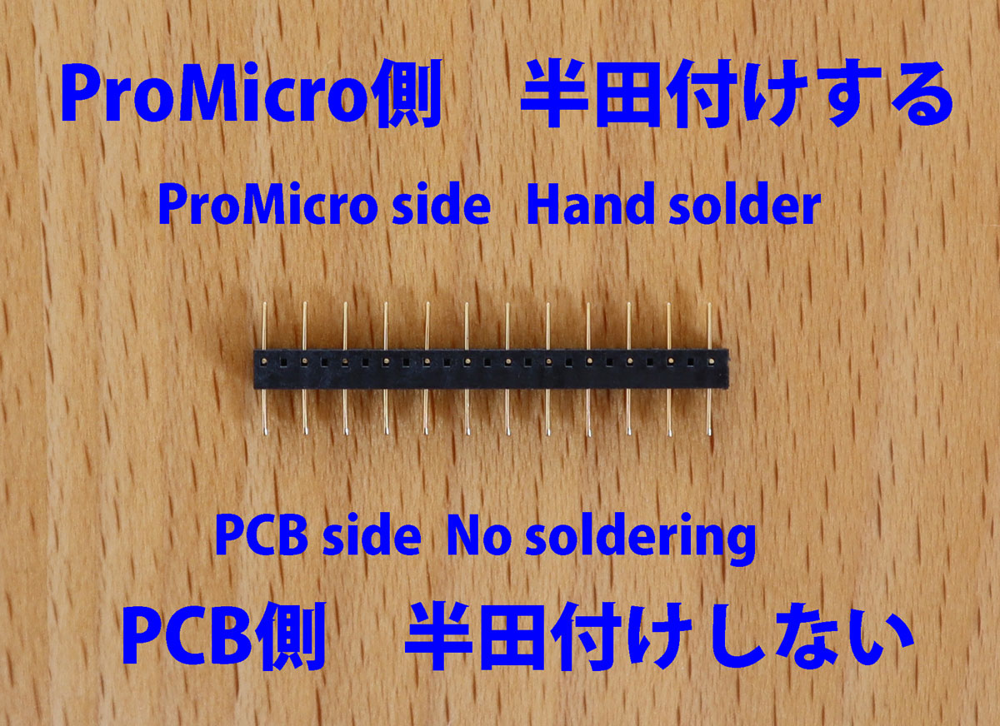
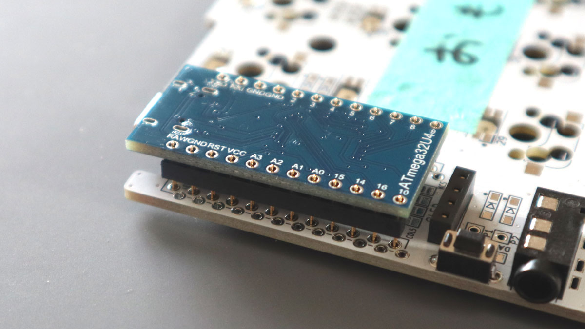
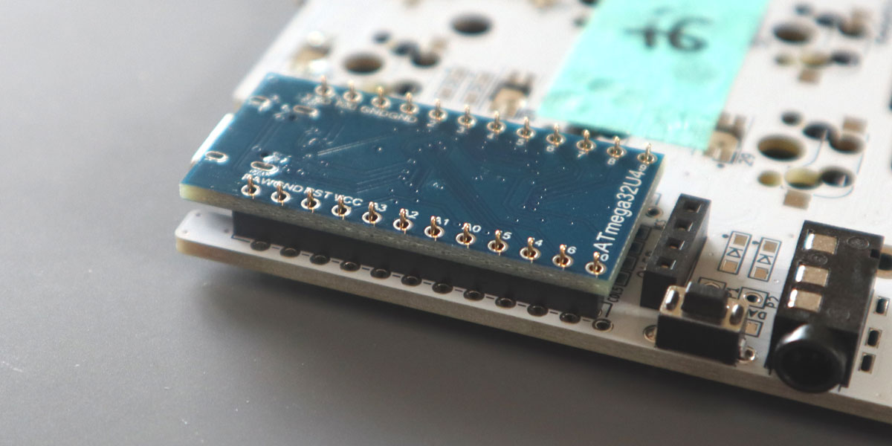

# Build Guide for Keyball44

This is the build guide for Keyball44.

●[日本語のビルドガイドはこちら](https://github.com/Yowkees/keyball/blob/main/keyball44/doc/rev1/buildguide_jp.md).
  

## 【Contents of Build Guide for Keyball44】

  - [1. Parts Check](#1)
    - [1-1. Items included in the kit](#1-1)
    - [1-2. Parts to be prepared by the customer before assembly](#1-2)
    - [1-3. Parts and options that can be installed after assembly](#1-3)
  - [2. Preparation](#2)
    - [2-1. Required Tools](#2-1)
    - [2-2．Firmware](#2-2)
  - [3. Mounting](#3)
    - [3-1. Before Soldering](#3-1)
    - [3-2. Soldering the Diodes](#3-2)
    - [3-3. Soldering LEDs (option)](#3-3)
    - [3-4. Soldering the key socket](#3-4)
    - [3-5. Soldering Jumpers](#3-5)
    - [3-6. 4 pin sockets, TRRS socket, tact switch](#3-6)
    - [3-7. Soldering ProMicro and OLED](#3-7)
    - [3-8. Writing and operation check of ProMicro](#3-8)
  - [4. Assemble the ball reader board](#4)
    - [4-1. Soldering the sensor](#4-1)
  - [5. Soldering the L-shaped spring-loaded pin headers](#5)
  - [6. Cut the top plate (option)](#6)
  - [7. Assembly](#7)
    - [7-1. Assemble the Top Plate](#7-1)
    - [7-2. Assemble the Bottom Plate](#7-2)
    - [7-3. Install the protection plate](#7-3)
  - [8. Trackball Installation](#8)
    - [8-1. Insert ball reader board](#8-1)
    - [8-2. Assemble the trackball case](#8-2)
    - [8-3. Trackball Case Installation](#8-3)
  - [9. Finishing](#9)
  - [10. Write the official firmware](#10)
  - [11. How to use Keyball](#11)

## 1. Parts Check

When you receive your kit, please make sure whether all the items included in the kit.

### 1-1. Items included in the kit

The Keyball44 has one Trackball that can be attached on Right or Left side.

Included parts in the Keyball44 Standard Kit are the following

*If your kit includes 12P pinsockets and pinheaders instead of 12P conthru pinheaders , please see [this buildguide](https://github.com/Yowkees/keyball/blob/main/keyball44/doc/rev1/buildguide_en_pinheader.md#1-1).

| Name | Number | Note |
|:-|:-|:-|
| Middle PCBs (left and right) | 1 set | |
| Top PCB plates (left and right) | 1 set | |
| Middle Acrylic plates (left and right) | 1 set | Main and Thumb plates |
| Bottom Acrylic plates (left and right) | 1 set | |
| ProMicro protection plate (left and right) | 1 set ||
| Trackball holding case white (top and bottom) | 1 set ||
| Φ2 Ceramic ball (spare) | 1 pcs ||
| Trackball reader circuit board | 1 plate ||
| Trackball readout IC | 1 pcs ||
| Lense for Trackball readout IC | 1 pcs ||
| L-shaped Conthrough pin (7-pin) | 1 pcs ||
| Flat head screw M1.7 | 2 pcs ||
| Small head screw M1.7 | 2 pcs ||
| TRRS Jack | 2 pcs ||
| Tact Switch | 2 pcs ||
| Straight Conthrough pin (12-pin) | 4 sets | |
| Diodes (Surface mounting type) | more 50 pcs ||
| Kailh PCB Socket for Cherry MX | more 44 pcs ||
| Kailh PCB Socket for choc | 5 pcs | For Thumb low-profile modification |
| OLED module | 2 pcs ||
| Pin header for OLED (4 pin) | 2 pcs ||
| Pin socket for OLED (4 pin) | 2 pcs ||
| Spacer M2 7mm | more 14 pcs ||
| Spacer M2 9mm | 4 pcs ||
| Spacer M2 4mm | 4 pcs | For Thumb low-profile modification |
| Screws M2 3.5mm | more 36 pcs + ||
| Cushion rubber | 10 pcs ||

### 1-2．Parts to be prepared by customers themselves before assembly

| Name | Number | Note |
|:-|:-|:-|
| ProMicro | 2 pcs |  You can choose from inexpensive ones or USB Type-C supported ones. |
| CherryMX Compatible Key Switches | 44 pcs | 39 pcs for Thumb low-profile |
| Low-profile choc Key Switches | 5  pcs | For Thumb low-profile |
| Trackball (34mm diameter) | 1 pc | Used to check operation |
| TRS (3-pole) cable | 1 cable | TRRS (4-pole) cable is also acceptable |
| Micro USB cable | 1 cable | Compatible with ProMicro you purchased |

### 1-3． Parts and options that can be installed even after assembled.

| Name | Number | Note |
|:-|:-|:-|
| CherryMX Compatible Keycaps | 44  pcs | 1u size x 44 pcs |
| Low-profile choc Keycaps | 5 pcs | For Thumb low-profile |
| [YS-SK6812MINI-E](https://shirogane-lab.net/items/64b8f178cbce52004b9555f9) | 59 pcs | *Notice: Cannot be used with SK6812MINI. |

## ２．Preparation

### 2-1．Required tools

You will need the following tools to assemble the Keyball44.

| Name |
|:-|
| Soldering iron (with adjustable temperature if you are mounting LEDs) |
| Solder (low melting point is effective when mounting LEDs) 
| No. 0 + precision screwdriver |
| Tweezers |
| cutter |
| Sandpaper of about 150-grit |

### 2-2．Firmware

In order for the Keyball44 to work, the firmware must be written to the ProMicro that you purchased.
Already-built firmware is available for easy writing with [REMAP](https://remap-keys.app/)a web-based keyboard management software.

Writing is explained in detail in [Chapter 3-8](#3-8Promicro Writing and Operation Verification) and [Chapter 10](#10 Writing the Firmware for the Product Version).

## ３. Mounting parts

Now it's time to start the soldering process.    
The PCB is reversible, so you first need to decide which one is for the left hand and which one is for the right hand.   

The trackball will be attached to the PCB missing position, indicated by the red circle.  
If you want to use your right thumb to control the trackball, Placement will look like the picture below.   

If you operate the trackball with your left hand, Placement is as shown in the picture below.  

In this build guide, we will use the specification to put the trackball on the right hand.  
Place the PCB as shown below, and put masking tape on the surface to prevent mistakes.
I wanted to write "TOP FACE" on masking tape.

### 3-1．Before soldering
The tip of the soldering iron should be shaped like a bamboo spear, so that you can put solder on a flat surface and scoop out excess solder.

### 3-2．Soldering the diodes
Now let's solder the diodes one by one.   
All the diodes should be soldered on 【BACK SIDE ONLY】.  
  
The silk marks on the diodes look like the arrows in the picture below. There are 45 diodes in total.  
Diodes have polarity, so be sure to install them in the correct orientation. The orientation is the direction where the straight line on the component matches the straight line on the end of the arrow on the silk mark.  

Look carefully at the picture below to confirm the orientation.  
All the diodes on the same board are oriented in the same direction, except for the diodes that are rotated 90 degrees. As you proceed with the soldering, make sure that the diodes are facing the same direction as the diodes around them.

  
The diode silk is marked with a black dot as shown in red in the following photo. So you can check the polarity even after the diode is soldered.

Aligning the diodes and counting the number of diodes before soldering will prevent reversing or forgetting to solder the diodes.

Twenty-two diodes are aligned near the board on the side with the trackball, and 24 diodes are aligned near the board on the side without the trackball.

Now let's start soldering. At first, put some solder on one side of the diode pad.

Grab the diode with tweezers and hold it in place while you melt the solder that was previously applied.

Rotate the board 180 degrees and apply solder to the legs on the other side of the diode.
Finally, touch both legs with a soldering tip, and if the diode does not fall out, both legs are soldered.

Install a total of 46 diodes on the left and right sides.

Please check the diode in the blue circle in the photo below, as we often forget to attach the diode.

### 3-3．Soldering the LEDs (optional)
LEDs (YS-SK6812MINI-E) are option.It is not included in the kit and should be obtained from[here](https://shirogane-lab.net/items/64b8f178cbce52004b9555f9)or other sources.

A total of 59 LEDs can be installed on both sides.

However, LEDs are very sensitive to heat, so adjust the soldering iron temperature from 220°C to 280°C, before soldering.

Since the tip temperature is low, the heat will not be transferred to the pad and it is easy to be failure soldering.  
The keyboard can be used without LEDs. I recommend to complete the project without LEDs first. You can add LEDs later.  

If LEDs are to be soldered, this is a good time to work with them.

Please note that all LEDs are soldered on the 【BACK SIDE】
  
Place the LED on the YS-SK6812MINI-E and solder by aligning the notched leg of the four pins of the YS-SK6812MINI-E with the marked pad.

Some LED faces up and some LED faces down, but as long as the notches and markings on the pins are aligned as shown in the photo below, the top and bottom will automatically align.

Soldering all four pins at once will cause the component to overheat and break easily, so solder two pins at a time. To do this, put about 10 LEDs on the board at a time, and once the solder is applied, move on to soldering the next LED. This way you can avoid continually applying heat to one LED.

When all LEDs have been soldered, we cannot yet confirm that the LEDs are lit at this time, so we proceed to the next step.

### 3-4．Soldering the key socket
The key socket is soldered on the 【BACK SIDE】 as diodes.

Set the key socket. Key socket's shape matches the silk mark, and solder it.  
If it protrudes from the silk, the direction is wrong.

When assembling with thumb low-profile specifications, solder low-profile sockets to the thumb keys (Total 5 keys). This low-profile socket also has a direction.

Please confirm the direction with the following pictures. The correct direction is that the terminal with the black plastic part close to the octagonal shape is near the middle of the switch.

First, insert the PCB socket in the correct orientation before soldering.

While warming the socket terminals, melt the solder from the direction of the red arrow (the other side).      

If you apply a tip with a little solder on it from the side of the terminal and hold the socket by tweezers from above, the solder will melt and the socket will sink.  
In my experience, this method is the least likely to result in a poor connection.  

Rotate the board 180 degrees and solder the terminals on the other side in the same way.

44 of these are soldered on the left and right sides together, This task is finished.
The PCB socket for the thumb keys can be just either a CherryMX compatible socket or a low-pro socket. In the photo, both are attached.

### 3-5. Soldering the jumpers
You need to short the jumpers to control the OLED module and trackball sensor.

The jumper is soldered on __【Back Side Only】__.  

First, short the jumper for the OLED.

"Back Side Only" is indicated, and there are 【4】 each on the left and right boards, so jumper them all.

The photo below shows the two left sides jumpered.
The pattern has been changed to a triangle type pattern for easier bridging.

You can bridge the pads by heating them with an iron tip to melt the solder.

If the solder is not fresh enough, the surface tension will drop and it will not bridge properly.
In this case, remove the solder and add more fresh solder or flux and try again.

Next, short the jumpers on the signal line for the trackball.
Solder the four jumpers in the positions shown in the photo below as shown in the photo. This is also done only on the [back side].

Finally, short the left hand judgment jumper.
There should be one jumper near the pinky key on the left-hand side of the board that is labeled LEFT, as shown in the photo below. Short-circuit this as well, but only on the back side.

The photo below shows all jumpers soldered in place.

Make sure that all four blue circles are soldered.

### 3-6．TRRS Socket・Tact Swicth・4-pin Socket
Solder the components shown in the photo below.  
Mount all of them on the __【TOP SURFACE】__.  

If you are worried about the parts floating around or moving, fix them with masking tape before soldering.

Note that too much solder (too long working time) when soldering a pin socket may cause the solder to flow inside the pin socket and prevent the pin header from sticking.
If you feel that solder is being sucked into a through-hole, finish soldering that pin and move on to the next pin.

When all are installed, it will look like the photo below.

Insert the component from the [front side] and solder the [back side] as shown in the photo below.

### 3-7．Soldering of ProMicro and OLED

The ProMicro can be replaced by soldering with the spring-loaded (Conthrough) pin headers pins shown in the photo below. The spring-loaded pin headers pins have mounting directions, so please look at the photo carefully.
【The pin headers included with ProMicro are not used】

If 12P pin headers + pin sockets were included instead of 12P Conthrough for ProMicro[【here】](https://github.com/Yowkees/keyball/blob/main/keyball44/doc/rev1/buildguide_en_pinheader.md#3-7promicro%E3%81%A8OLED%E3%81%AE%E3%81%AF%E3%82%93%E3%81%A0%E4%BB%98%E3%81%91)Please use this build guide.

First, insert the Conthrough pin headers on【TOP FACE】 of board.

Insert the conslue so that it fits the square frame of the silk. If the black frame of the silk is out of alignment with the conslue, the hole to insert is wrong.

Insert the conthlue so that it fits the square frame of the silk. If the black frame of the silk is out of alignment with the conslue, the hole to insert is wrong.

Insert the ProMicro into the inserted spring-loaded pin headers pin.  
Keep this state, and Solder ONLY the ProMicro side.
"Soldering while inserted" prevents the spring-loaded pin headers are installed at unexpected angle.

The top of ProMicro can be equipped with an OLED.  
Insert a 4-pin header into the 4-pin socket and place the OLED module on it.
And solder only one pin of 4 pins.  

While melting the solder, push the OLED module from above so that it does not float. You can also adjust it so that it is parallel to the ProMicro for a better look.

Once the position is set, solder the remaining 3 pins.

### 3-8．Write and check operation of ProMicro
OK, let's write the test firmware to the ProMicro.

The test firmware has a concise keymap for easy operation checks, and the RGB LEDs light red, green, and blue in that order, making it easy to detect solder defects.
If you think you do not need the test firmware, for example, if you are forgoing LED soldering this time, you can use the regular firmware in [Chapter 10](#10 Writing Regular Firmware) You may write it here.
  
The firmware for the Keyball44 is the same whether the trackball is placed in the right or left hand.
Please write (FLASH) [Keyball44_test.hex](https://remap-keys.app/catalog/tAJ9Htme4oNabUkx4832/firmware)that is registered in REMAP.
Press the FLASH button in the above link to see the instructions on how to write.

If the keyboard is not recognized even though the USB cable is connected, it will be recognized when the soldered RESET switch is pressed twice quickly.

*Be sure to write the same hex file to both the left and right ProMicro.

If you want to edit the Keyball44 firmware directly and build it yourself, you can find the source in [this repository](https://github.com/Yowkees/keyball/tree/main/qmk_firmware/keyboards/keyball).Source code is available for download.

After the writing is completed, short the key switch pad with tweezers as shown in the picture below to check the operation.  
sides of the keyboard may be reversed, but this is no problem right now. Please just check that some characters are entered and that ProMicro is working. It is not necessary to try all keys yet.
The earlier you check the operation, the easier it will be to isolate the problem.

Also, check the LEDs at this time.
The LEDs are wired in series and assigned numbers. If LEDs 1 through 12 light up, but 13 and beyond do not, there is a problem with the soldering of LEDs 12 or 13. Try re-soldering or replacing the LEDs.

*Be sure to write the same hex file to both the left and right ProMicro.

## ４．Assemble the ball-reading board
Prepare the board shown in the photo below (hereinafter referred to as the "ball board") and the sensor.

In some cases, you may receive a pre-soldered board to check the quality of the sensor and board. If this case, please skip this step and proceed to Chapter 5, Soldering the L-shaped 7pin Conthrough header.

  

## 4-1. Soldering the optical sensor  

Insert the sensor IC from the __【BACK SIDE】__ of the ball board where no electric components are mounted.
Align the indentation indicating pin 1 of the IC with the pad mark on the board.

This is the direction of the IC when viewed from the back. Solder all pins from the surface where the component is mounted.

Use tweezers to peel off the protective stickers 【2 sheets】.

Attach the sensor lens to the side where the stickers were removed.
The lens has an direction. Please make sure the direction is correct, as the two thin pins of the lens may break if the direction is wrong.  
The lens has a protrusion in front of it as shown by the arrow in the photo below.

If the direction of the lens and IC match, the two pins of the lens should be able to be inserted into the IC softly and smoothly. Notice: Insert Lens slowly!

### ５．Soldering the L-shaped conthrough pin header
Next, attach the L-shaped spring-loaded 7pin headers to the right-hand board __【TOP FACE】__.  
The L-shaped spring-loaded pin headers also have a direction, and should be installed in the same way as in the picture below.  
Solder the one straight pins that does not have a U-shape.

Put a masking tape on the component to prevent it from floating.

And solder it from back side.

This completes the soldering process.

As a side note, before de-energizing the soldering iron, put plenty of solder on the tip. The next time you use the soldering iron, you can remove the solder and resume work with a shiny soldering tip!

## ６．Cutting of top plate  

Keyball44 can switch 5 thumb keys to choc low profile switches.

In this case, the perforations on the top plate must be cut away.

To cut them off, use a cutter to cut into the perforated areas on the front and back sides, then fold and separate them.

If you want to use regular Cherry MX switches for the thumb keys, you do not need to detach the board.

Even if you detach the board, you can install either choc switches or MX switches on the thumb keys, so if you want to try using both, we recommend you to detach the board here.

The detached cross section should be prepared with about 150-grit sandpaper.

## ７．Assembly 

### 7-1. Assembling the top plates  

Screw the 7mm spacers to the 【BACK SIDE】 of the top plate.

When assembling thumbs with low-profile specifications, install 4mm spacers on the top plate for thumb keys.

Next, screw the four 11mm spacers to the left and right middle boards.

Note that if you forget to do this and install the bottom plate, the 11mm spacers will not be able to be screwed in place.

Insert the key switches into the four corners of the top plate and the thumb plate.

This will improve the positioning accuracy between the plates.

Align the screw holes on the top plate and middle acrylic plate and stack the plates on top of each other.

Next, the soldered middle board is also stacked, making sure that the screw holes are aligned and the key switch terminals are firmly inserted into the key sockets.

### 7-2. Assembling the bottom plates 

Overlap the acrylic bottom plate from the back side and screw it in place.
Next, attach the cushion rubbers to the four corners of the keyboard.

### 7-3.Installation of protection plate  

Screw the acrylic protection plate onto the 11mm spacer.

The shape of the protection plate is the same for both sides with and without trackball. There is no front or back.

  

## ８．Trackball installation 

### 8-1. Insert the trackball reading board  

Insert the assembled trackball reader board into the 7-pin conthrough pin header. The board should be inserted vertically.

The ball board is now standing vertically.

### 8-2.Assemble the trackball case  

3 ceramic balls are fixed to the trackball case in advance. If the ceramic balls have fallen off, please fix by spare ceramic ball with a suitable bond.  
Please keep the spare ceramic ball in case you lose them in the future.

Shake the case to make sure the ceramic ball does not fall out.

The 2 pins on the top case can be inserted into the holes on the bottom case.  
Gently apply pressure from above and below to join them. (It's okay if you don't get a tight fit, because it will stick after this screw tightening.)

Attach an M1.7 tapping screw. The kit includes two types of screws: "small head screws" and "flat head screws". In this process, please use "small head screws".

Screw in these two locations as seen from the back of the case. Be careful not to over-tighten them.

### 8-3. Trackball case installation  

Attach the completed ball case to the main unit. The ball board is placed in the sensor compartment on the back side of the case.  
Gently fit the case from the top, making sure that the ball board indicated by the arrow is at the center of the case. If there is any sticking, do not force it in, but pull it out and reinsert it.

It should go all the way in without much effort.

If you check from the back of the unit, there may be a gap between the main board and the ball board, as indicated by the arrow.

In this case, lightly push from the front of the case (in the direction of the finger mark). If you use too much force, the L-shaped construe may be damaged, so press lightly.  
If the gap disappears as shown in the picture below, the screw holes in the blue circle will fit.

Tighten the two M1.7 Torx screws with __【wide flat heads】__ from the back of the body. Tighten the screws while holding the ball retainer case with your fingers to prevent it from rotating.

## ９．Total finish 

We are nearing completion! Fit the key switches of your choice.

Finally, push the 34mm trackball into the case and Keyball61 Building have done! 
Thank you for your hard working.  

## １０．Write the regular firmware

Finally, let's write the firmware to ProMicro.

Keyball44 supports[ReMAP](https://remap-keys.app/configure), you can write firmware and change the keymap without installing any special software. 

To use REMAP, please write the following VIA-supported firmware

   - Keyball44 VIA-supported firmware [Keyball44 firmware page in the REMAP catalog](https://remap-keys.app/catalog/tAJ9Htme4oNabUkx4832/firmware), open the Keyball44_via and FLASH the firmware.

For writing, as written in[Chapter 3-8](#3-8 Write and check operation of ProMicro),press the FLASH button and instructions on how to write will appear.
If the keyboard is not recognized even though the USB cable is connected, press the soldered RESET switch twice quickly and it will be recognized.

*Be sure to write the same hex file to both left and right Pro Micro.

■If you want to build the firmware by yourself   
The latest firmware for Keyball44 is available at[Github repository](https://github.com/Yowkees/keyball/tree/main/qmk_firmware/keyboards/keyball). Copy this keyball folder to your QMK_Firmware/keyboards and edit the keymap etc. freely and build.  

## １１． How to use Keyball
   - The trackball motion will change to scroll up, down, left and right while switching to layer 3.
   - Keyball supports [ReMAP](https://remap-keys.app/configure),so you can check, change and write keymap easily.
   - The USB cable can be plugged in either left or right. However, since the keymap is written to the ProMicro on the side where the USB cable is plugged in, please review the keymap when replacing the cable for the first time.
   - There are Special keys for Keyball users as below list. It is located on Layer 3. These key codes can be used for switching Cursor action to Scroll or Changing CPI and Speed of Scroll.

See [Special Keycode](../../../qmk_firmware/keyboards/keyball/lib/keyball/keycodes.md#japanese) also.

This concludes the Keyball44 build guide.
If you have any questions or problems with Keyball, please post them to the Github repository 
[Yowkees/keyball Discussions](https://github.com/Yowkees/keyball/discussions). We'll get back to you as soon as possible.

Thank you very much. @Yowkees
