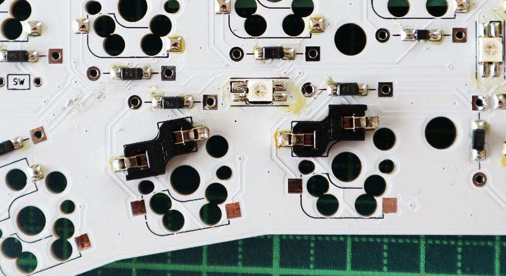

# Build Guide for Keyball46

This is the build guide for Keyball46.

Keyball46 is a split keyboard with integrated thumb trackball.

●[日本語のビルドガイドはこちら](https://github.com/Yowkees/keyball/blob/main/keyball46/doc/rev1/buildguide_jp.md)

## [Contents of Build Guide for Keyball46]
  - [1. Parts Check](#1)
    - [1-1. Kit Bundled Items](#1-1)
    - [1-2. Parts to be prepared by the customer before assembly](#1-2)
    - [1-3. Parts and options that can be installed after assembly](#1-3)
  - [2. Preparation](#2)
    - [2-1. Required Tools](#2-1)
    - [2-2. Firmware](#2-2)
  - [3. Mounting](#3)
    - [3-1. Before Soldering](#3-1)
    - [3-2. Soldering the Diodes](#3-2)
    - [3-3. Soldering Jumpers](#3-3)
    - [3-4. 4 pin sockets, TRRS socket, tact switch](#3-4)
    - [3-5. Soldering ProMicro](#3-5)
    - [3-6. Writing and operation check of ProMicro](#3-6)
    - [3-7. Soldering the underglow LED (option)](#3-7)
    - [3-8. Soldering the key socket](#3-8)
  - [4. Assemble the ball reader board](#4)
  - [4-1. Soldering the sensor](#4-1)
    - [4-2. Soldering the L-shaped spring-loaded pin headers](#4-2)
  - [5. Solder the left-hand side left-right jumper](#5)
  - [6. Cut the top plate (option)](#6)
  - [7. Assembly](#7)
    - [7-1. Install the protection plate](#7-1)
    - [7-2. Assemble the Top Plate](#7-2)
    - [7-3. Assemble the Bottom Plate](#7-3)
  - [8. Trackball Installation](#8)
    - [8-1. Insert ball reader board](#8-1)
    - [8-2. Assemble the trackball case](#8-2)
    - [8-3. Trackball Case Installation](#8-3)
  - [9. Finishing](#9)
  - [10. Write the official firmware](#10)
  - [11. How to use Keyball](#11)

## 1. Check the parts

When you receive your kit, please make sure whether all the items included in the kit.

### 1-1. Items included in the kit

| Name | Number | Note |
|:-|:-|:-|
| PCB (left and right) | 1 set | | 
| Top PCB plate (left and right) | 1 set | | 
| Bottom acrylic plate (left and right) | 1 set ||
| ProMicro protection plate (left and right) | 1 set ||
| Trackball holding case white (top and bottom) | 1 set ||
| Φ2 Ceramic ball (spare) | 1 pcs ||
| Trackball reader circuit board | 1 plate ||
| Trackball readout IC | 1 pcs ||
| Lense for Trackball readout IC | 1 pcs ||
| Flat head screw M1.7 | 2 pcs ||
| Small head screw M1.7 | 2 pcs ||
| TRRS Jack | 2 pcs ||
| Tact Switch | 2 pcs ||
| Diode (Surface mounting type) | 52 pcs + | Lead type also available (option) |
| Kailh PCB Socket | 50 pcs ||
| OLED module | 2 pcs ||
| Pin header (4 pin) | 2 pcs ||
| Pin socket (4 pin) | 2 pcs ||
| Spacer M2 7mm | 15 pcs ||
| Spacer M2 9mm | 5 pcs ||
| Screws M2 3.5mm | 38 pcs + ||
| Cushion rubber | 8 pcs ||

### 1-2. Parts to be prepared by customers themselves before assembly

The following are the parts you need to prepare before assembly.

| Name | Number | Note |
|:-|:-|:-|
| ProMicro | 2 pcs | You can choose from inexpensive ones or USB Type-C supported ones. |
| Keyswitches | 46 pcs | CherryMX compatible keyswitches |
| Trackball (34mm diameter) | 1 pc | Used to check operation |
| TRS (3-pole) cable | 1 cable | TRRS (4-pole) cable is also acceptable |
| Micro USB cable | 1 cable | Compatible with ProMicro you purchased |

### 1-3. Parts and options that can be installed even after assembled.

| Name | Number | Note |
|:-|:-|:-|
| Keycaps | 46 pcs | 1U size x 45 pcs, 1.25U size x 1 pcs |
| YS-SK6812MINI-E | 14 pcs | For underglow *Notice: Cannot be used with SK6812MINI. |

## 2. Preparation

### 2-1. Required tools

You will need the following tools to assemble the Keyball46.

| Name |
|:-|
| Soldering iron (with adjustable temperature if you are mounting LEDs) |
| Solder (low melting point is effective when mounting LEDs) |
| Nippers |
| No. 0 + precision screwdriver |
| Tweezers |

### 2-2. Firmware

In order to run the Keyball46, you need to write the firmware to the ProMicros you purchased.
For more information about QMK Toolbox, please refer to [Corne's Firmware](https://github.com/foostan/crkbd/blob/master/doc/firmware_en.md) about QMK Toolbox, please read the first half of the link and prepare QMK Toolbox.  

For more information on writing firmware, see [Chapter 3-6](#3-6) for writing test firmware, and [Chapter 10](#10) for writing production firmware.

</a>
## 3. Mounting

Now it's time to start the soldering process.  
The PCB is reversible, so you first need to decide which one is for the left hand and which one is for the right hand.  

The trackball will be attached to the PCB missing position, indicated by the red circle.  
If you want to use your right thumb to control the trackball, Placement will look like the picture below.  

If you operate the trackball with your left hand, Placement is as shown in the picture below. 

In this build guide, we will use the specification to put the trackball on the right hand.  
Place the PCB as shown below, and put masking tape on the surface to prevent mistakes.
I wanted to write "TOP FACE" on masking tape.

### 3-1. Before Soldering
The tip of the soldering iron should be shaped like a bamboo spear, so that you can put solder on a flat surface and scoop out excess solder.

.
### 3-2. Soldering the diodes
Now let's solder the diodes one by one.  
All the diodes should be soldered on 【BACK SIDE ONLY】.  
  
The silk marks on the diodes look like the arrows in the picture below. There are 48 diodes in total.  
Diodes have polarity, so be sure to install them in the correct orientation. The orientation is the direction where the straight line on the component matches the straight line on the end of the arrow on the silk mark.  
  
Look carefully at the picture below to confirm the orientation.  
All the diodes on the same board are oriented in the same direction, except for the diodes that are rotated 90 degrees. As you proceed with the soldering, make sure that the diodes are facing the same direction as the diodes around them.

Although not included in the kit, it is designed to accept leaded diodes. (However, if you assemble it with the low profile (choc) specification, you cannot use the leaded type because it will interfere with the top plate.  
  
Surface mounting type diodes are quicker to work with once you get used to them, but they do require tweezers to hold them stationary on the board, which is certainly more difficult. Either type can be used as you prefer.  
  
When using the lead type, the polarity should be attached so that the straight line of the silk mark and the strip mark on the component face the same direction, as shown below.

Now let's start soldering. At first, put some solder on one side of the diode pad.

Grab the diode with tweezers and hold it in place while you melt the solder that was previously applied.

Rotate the board 180 degrees and apply solder to the legs on the other side of the diode.
Finally, touch both legs with a soldering tip, and if the diode does not fall out, both legs are soldered.

If you are using a leaded diode, pass the legs through the through-hole outside the silk.

Leaded diodes are soldered from the top surface.

After soldering, cut off the excess legs.  
The leaded type cannot be used for low-profile (choc) assembly because it leaves a solder heap on the surface.  
If only the thumb key is to be low-profile, solder only the thumb keys with the surface mounting type.

Install 24 diodes on the right hand board.

Do the same for the left hand board. There are 24 diodes on this board.  
I often forget to install the diodes or only one side is not soldered, so make sure you count them.

### 3-3. Soldering the jumpers
You need to short the jumpers to control the OLED module and trackball sensor.
The jumper is soldered on __【Back Side Only】__.  
"Back Side Only" is indicated, and there are a total of 【8 points】 on the right-hand board.  
You can bridge the pads by heating them with an iron tip to melt the solder.

There are 8 pads on the right hand board.

If the solder is not fresh enough, the surface tension will drop and it will not bridge properly.
In this case, remove the solder and add more fresh solder or flux and try again.

The left hand board also needs to be jumpered on __【Back Side Only】__, too.  
There are 4 jumpers.  
There are more jumper pads on the left hand board, but they are not used. they are for developers. So you don't need to solder them.

### 3-4.4-pin Socket, TRRS Socket, Tact Switch
Solder the components shown in the photo below.  
Mount all of them on the __【TOP SURFACE】__.  

If you are worried about the parts floating around or moving, fix them with masking tape before soldering.

### 3-5. Soldering the ProMicro
The ProMicro can be replaced by soldering with the spring-loaded pin headers pins shown in the photo below. The spring-loaded pin headers pins have mounting directions, so please look at the photo carefully.

First, insert the spring-loaded pin headers into the right-hand board.

Insert the ProMicro into the inserted spring-loaded pin headers pin.  
Keep this state, and Solder ONLY the ProMicro side.

"Soldering while inserted" prevents the spring-loaded pin headers are installed at unexpected angle.

Solder the left-hand board in the same way.

The top of ProMicro can be equipped with an OLED.  
Insert a 4-pin header into the 4-pin socket and place the OLED module on it.

Solder only one of the 4 pins.  
While melting the solder, push the OLED module from above so that it does not float. You can also adjust it so that it is parallel to the ProMicro for a better look.

Once the position is set, solder the remaining 3 pins.

Solder one more OLED on the right-hand board in the same way.

### 3-6. Writing and testing ProMicro
First, let's write the test firmware to the ProMicro.  

The test firmware has a concise keymap to make it easy to check the operation, and the RGB LEDs light up in the order of red, green and blue. So it's easy to detect bad solder.
If you think you don't need the test firmware, such as if you are foregoing LED soldering this time, you can write the regular firmware in [Chapter 10](#10 Writing Regular Firmware) at this time.  
  

There are different types of firmware for the Keyball46 depending on whether you put the trackball on your right or left hand. Download the zip file from the appropriate one's link below, unzip it, and write it by QMK ToolBox.  
   - If you put the trackball on your right hand side, download this [keyball_test_1.0.0.zip](https://github.com/Yowkees/keyball/files/6809109/keyball_test_1.0.0.zip)
   - If you put the trackball on your left hand side, download [keyball_test_Left_1.0.0.zip](https://github.com/Yowkees/keyball/files/6809113/keyball_test_Left_1.0.0.zip)

When you unzip the zip file, you will find two hex files inside, and Keyball46 will write different firmware for left and right hand side.
   - keyball_rev1_ball_test.hex ← The one with "ball" in the name will be written to the board with trackball.
   - keyball_rev1_noball_test.hex ← If this "noball" is included in the name, write to the board without trackball.

For more information about QMK Toolbox, please refer to the article [Corne's firmware](https://github.com/foostan/crkbd/blob/master/doc/firmware_en.md). 

After the writing is completed, short the key switch pad with tweezers as shown in the picture below to check the operation.  
It is easier to isolate the problem if you check the operation at an early stage.

Verify that text is entered into the text editor.  
If "N" key or "B" key does not work, just ignore it. After Keyball46 is completely built, this problem will be fix.  
※ ~~Once the Keyball46 is complete, the USB cable should be connected to the side with the trackball attached. If you do not, the trackball will not function.~~ With the latest firmware, the trackball will function with the USB cable connected to either the left or right side! 

### 3-7. Soldering the LED for underglow (optional)
The LED (YS-SK6812MINI-E) is an option. A total of 14 LEDs can be installed on both sides.  
However, LEDs are very sensitive to heat, so adjust the soldering iron temperature from 220°C to 280°C, before soldering.  
Since the tip temperature is low, the heat will not be transferred to the pad and it is easy to be failure soldering.  
The keyboard can be used without LEDs. I recommend to complete the project without LEDs first. You can add LEDs later.  
  
Align the notched legs of the 4 pins of the YS-SK6812MINI-E with the marked pads.

Solder the pins as shown in the picture below.  
If you solder all 4 pins at once, the temperature of the component will rise and it will easily break. So solder one or two pins at once. Move to next LED. Later back to this LED's soldering.

After the soldering is complete, check the lighting.  
The LEDs are wired in series, so if the light only comes on halfway, fix it by soldering the LED and the LED next to it, or by replacing the LED.  
When all seven LEDs are lit, it looks like the picture below.  
  
Also, if there is solder residue on the board or another pad, as shown in the blue circle, it is difficult to remove if the temperature of the tip is low.
So, it should be removed by high temperature soldering iron, later.

### 3-8. Soldering the key socket
Set the key socket. Key socket's shape matches the silk mark, and solder it.  
If it protrudes from the silk, the direction is wrong.

Solder the pad to the socket as shown in the blue circle.

If you apply a tip with a little solder on it from the side of the terminal and hold the socket by tweezers from above, the solder will melt and the socket will sink.  
In my experience, this method is the least likely to result in a poor connection.  

Rotate the board 180 degrees and solder the terminals on the other side in the same way.

If you use a low profile socket (kailh choc), it will look like the picture below.

46 of these are soldered on the left and right sides together, This task is finished.

## 4. Assemble the ball-reading board
Prepare the board shown in the photo below (hereinafter referred to as the "ball board") and the sensor.
In some cases, you may receive a pre-soldered board to check the quality of the sensor and board. If this case, please skip this step and proceed to Chapter 4-2, Soldering the L-shaped spring-loaded pin headers.

  

## 4-1. Soldering the sensor  

Insert the sensor IC from the __【BACK SIDE】__ of the ball board where no electric components are mounted.  
Align the indentation indicating pin 1 of the IC with the pad mark on the board.

This is the direction of the IC when viewed from the back. Solder all pins from the surface where the component is mounted.

Use tweezers to peel off the protective stickers 【2 sheets】.

Attach the sensor lens to the side where the stickers were removed.

The lens has a direction.  
There is a protrusion at the front of the lens that looks like an arrow in the picture below. Install it so that it is on the top side.

### 4-2. Soldering the L-shaped spring-loaded pin headers
Next, attach the L-shaped spring-loaded pin headers to the right-hand board __【TOP FACE】__.  
The L-shaped spring-loaded pin headers also have a direction, and should be installed in the same way as in the picture below.  
Solder the one straight pins that does not have a U-shape.

Put a masking tape on the component to prevent it from floating and solder it.

## 5. Solder the left/right decision jumper on the left hand side. 

The standard firmware of the Keyball46 has an automatic left/right detection function. To activate this, solder a jumper on the __【Left hand board only】__.  

If you look at the left hand side board from the back, you will see a silk __[SW]__ in the red circle in the photo below. Please solder this Jumper with a piece of scrap lead wire, copper wire, or unused pin header pin pulled out with pliers.

If you are assembling for left-handed use, you have to jumper only the __【Left side board】__. __[SW]__ is located in the red circle in the photo below. 
(Depending on the production lot of the board, the position and inclination of the [SW] may be slightly different.)

When assembling the board with low-profile (kailh choc) specification, if the solder protrudes from the surface of the board, it will interfere with the top plate.  
When jumpering with lead wires, cut the legs short in advance as shown in the picture below.

You can fit it into the through-hole and solder it from the back side, as shown in the picture below, to prevent the solder from sticking out on the surface. If the solder is sticking out, scoop it out from the surface.

This completes the soldering process.

As a side note, before you turn off the soldering iron, be sure to put plenty of solder on the tip. When you use it next time, you can remove this solder and start working with a shiny tip!

## 6. Cut the top plate (optional)  

Keyball46 can be also made low profile only for thumb keys.  
To do it, cut the perforations.  
If you do not need to change the height of thumb keys, you do not need to cut it out.  
  
To cut it out, scratch the perforation with a bigger nipper.  

You can use a cutter to make a few more cuts to separate the pieces.

Both the left and right sides have been cut away.

Remove burrs with a sand paper of about 150 Grid.

## 7. Assembly 

### 7-1. Mounting the Protection Plate  

Attach the ProMicro protection plate to the middle board.
First, screw in the 9mm spacer.

Screw in the acrylic protection plate. Fix the right hand side with 3 spacers and the left hand side with 2 spacers.

  

### 7-2. Assembling the top plate  

Screw the 7mm spacers (or 4mm spacers for the low-profile version) to the 【back side】 of the top plate.

Insert the key switches into the four corners of the top plate. This will improve the positioning accuracy between the plates.

Align the screw holes of the top plate and the middle plate, and stack the plates on top of each other, making sure that the terminals of the key switch are firmly in the key socket.

### 7-3. Assembling the bottom plate  

Stack the acrylic bottom plate from the back side and screw it in place. There are 7 screws on each side.

## 8. Trackball installation 

### 8-1. Insert the trackball reading board  

Insert the assembled trackball reader board into the 7-pin spring-loaded pin headers. The board should be inserted vertically.

The ball board is now standing vertically.

### 8-2. Assemble the trackball case  

3 ceramic balls are fixed to the trackball case in advance. If the ceramic balls have fallen off, please fix by spare ceramic ball with a suitable bond.  
Please keep the spare ceramic ball in case you lose them in the future.

The 2 pins on the top case can be inserted into the holes on the bottom case.  
Gently apply pressure from above and below to join them. (It's okay if you don't get a tight fit, because it will stick after this screw tightening.)

Use the M1.7 Torx screws. The kit comes with two types of Torx screws, one with a 【small head】 and the other with a 【wide flat head】.
In next process please use __【2 small head】__ screws.

Screw in these two locations as seen from the back of the case. Be careful not to over-tighten them.

### 8-3. Trackball case installation  

Attach the completed ball case to the main unit. The ball board is placed in the sensor compartment on the back side of the case.  
Gently fit the case from the top, making sure that the ball board indicated by the arrow is at the center of the case. If there is any sticking, do not force it in, but pull it out and reinsert it.

It should go all the way in without much effort.

If you check from the back of the unit, there may be a gap between the main board and the ball board, as indicated by the arrow.

In this case, lightly push from the front of the case (in the direction of the finger mark). If you use too much force, the L-shaped construe may be damaged, so press lightly.  
If the gap disappears as shown in the picture below, the screw holes in the blue circle will fit.

Tighten the two M1.7 Torx screws with __【wide flat heads】__ from the back of the body. Tighten the screws while holding the ball retainer case with your fingers to prevent it from rotating.

## 9. Total finish. 

We are nearing completion! Fit the key switches of your choice.

Finally, push the 34mm trackball into the case and Keyball46 Building have done! 
Thank you for your hard working.  

## 10. Write the regular firmware 

The Keyball46 supports [Remap](https://remap-keys.app/configure), so you can change the keymap without build environment. You can read more about how to use Remap in the [Salicylic Acid in Jiki Onsen Guide](https://salicylic-acid3.hatenablog.com/entry/remap-manual) article.  

As mentioned in the section on writing test firmware, there are different types of firmware for the Keyball46 depending on whether the trackball is placed in the right or left hand. Please download the zip file from the link of the appropriate one below.
   - If you put the trackball on the right hand side, download this [keyball_via_1.0.0.zip](https://github.com/Yowkees/keyball/files/6809101/keyball_via_1.0.0.zip)
   - If you have the trackball on your left hand side, download [keyball_via_Left_1.0.0.zip](https://github.com/Yowkees/keyball/files/6809107/keyball_via_Left_1.0.0.zip)

When you unzip the zip file, you will find two hex files inside, and Keyball46 will write different firmware for left and right hand side.
   - keyball_rev1_ball_via.hex ← The one with "ball" in the name will be written to the board with trackball.
   - keyball_rev1_noball_via.hex ← If this "noball" is included in the name, write to the board without trackball.

Please use QMK Toolbox for writing.

■If you want to build the firmware by yourself
The latest firmware for the Keyball46 is available in the [Github repository](https://github.com/Yowkees/keyball/tree/main/qmk_firmware/keyboards/keyball). Please copy this keyball folder to your QMK_Firmware/keyboards and edit the keymap freely and make it.  

## 11. How to use Keyball 
   - The trackball motion will change to scroll up, down, left and right while switching to layer 3.
   - Keyball supports [Remap](https://remap-keys.app/configure), so you can check, change and write keymap easily.
   - The USB cable can be plugged in either left or right. However, since the keymap is written to the ProMicro on the side where the USB cable is plugged in, please review the keymap when replacing the cable for the first time.
   - There are Special keys for Keyball users as below list. It is located on Layer 3. These key codes can be used for switching Cursor action to Scroll or Changing CPI and Speed of Scroll.

See [Special Keycode](../../../qmk_firmware/keyboards/keyball/lib/keyball/keycodes.md#english) also.

This concludes the Keyball46 build guide.
If you have any questions or problems with Keyball46, please post them to the Github repository [Yowkees/keyball Discussions](https://github.com/Yowkees/keyball/discussions). We'll get back to you as soon as possible.

Thank you very much. @Yowkees 2021
