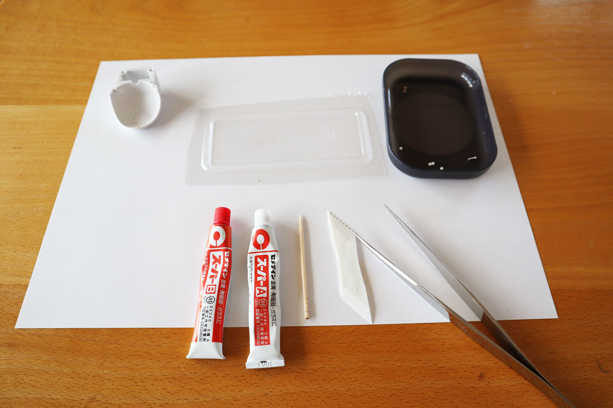
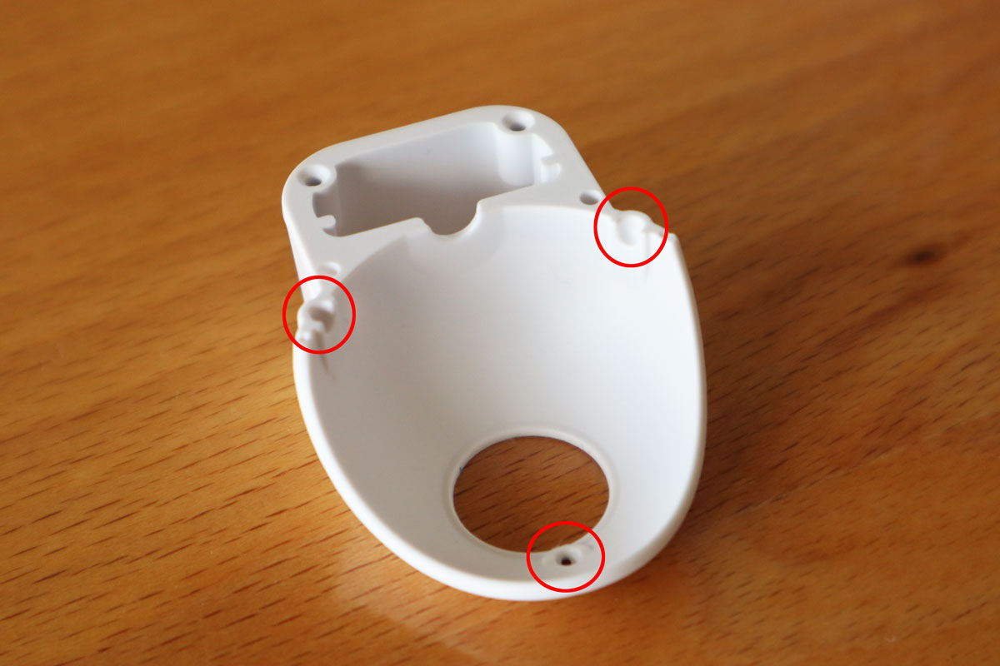
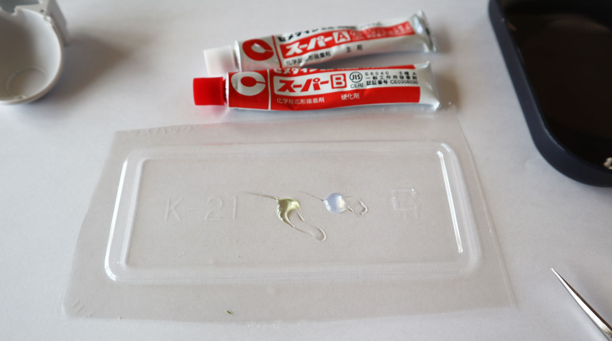
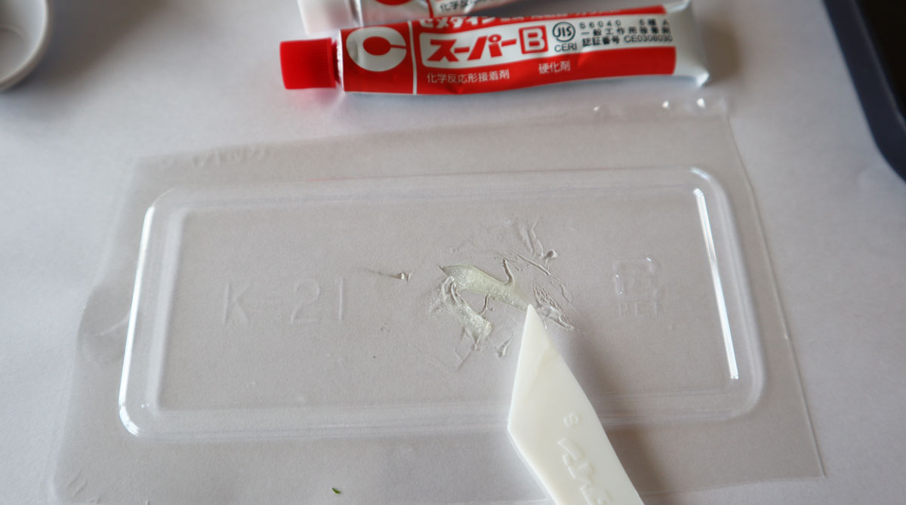
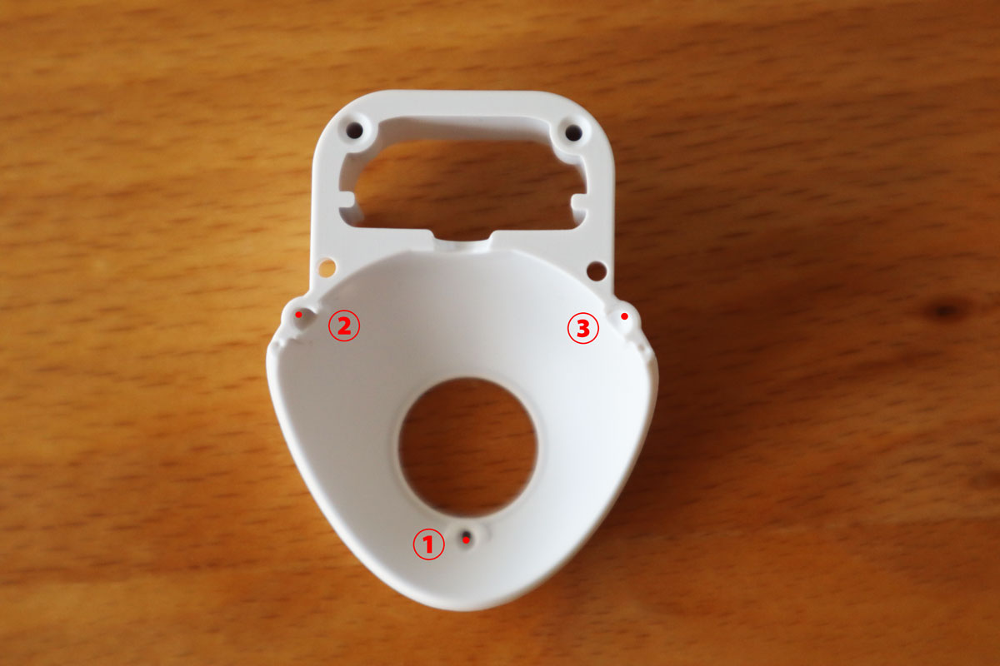
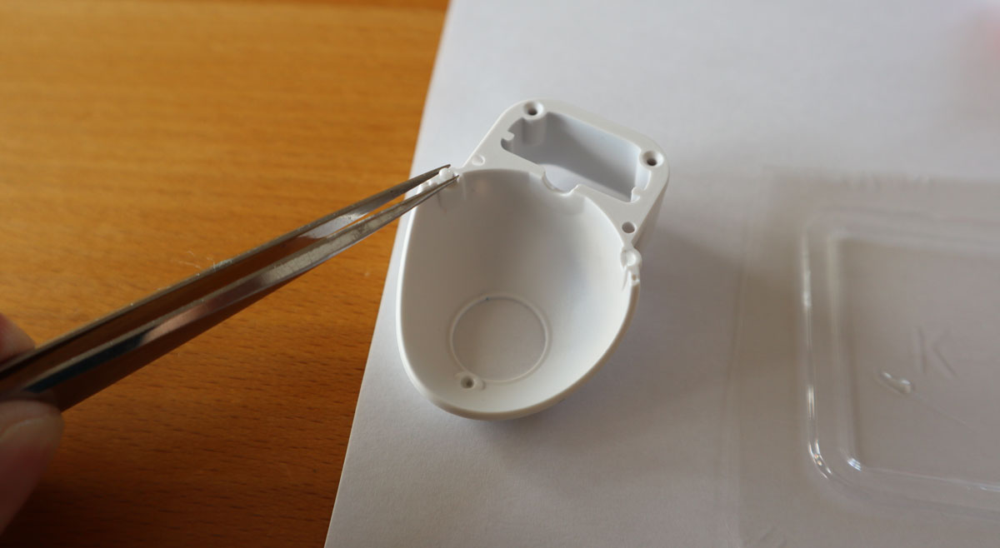
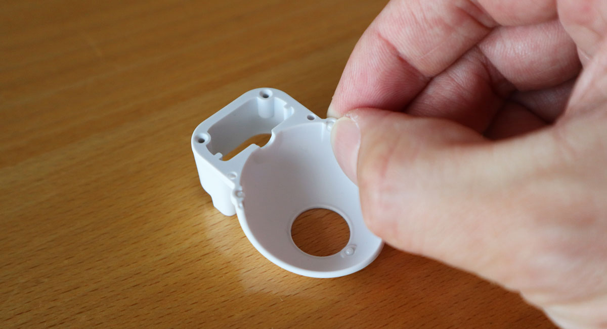

# Build Guide for Keyball46

こちらは Keyball46 のビルドガイドになります。

## 部品

キットが届きましたらキット同梱品がすべて入っていたかご確認ください。

### キット同梱品

| 名前 | 数 | 備考 |
|:-|:-|:-|
| PCB(左右) | １組 | |
| トップPCBプレート(左右) | １組 | |
| ボトムアクリルプレート(左右) | １組 | |
| ProMicro保護プレート(左右) | １組 | |
| トラックボール保持ケース白(上下) | １組 | |
| Φ2 セラミックボール | 5個 | （予備2個） |
| トラックボール読取り基板 | １枚 | |
| L字コンスルーピン(7ピン) | １個 | |
| トラックボール読取りIC | １個 | |
| 読取りIC用レンズ | １個 | |
| 平頭ネジ M1.7 | ２本 | |
| 小頭ネジ M1.7 | ２本 | |
| TRRSジャック | ２個 | |
| タクトスイッチ | ２個 | |
| ダイオード（チップタイプ） | ５２個＋ | リードタイプにも対応(オプション) |
| Kailh PCBソケット | ５０個 | |
| OLEDモジュール | １枚 | |
| 4連ピンヘッダ  | ２つ | |
| 4連ピンソケット | ２つ | |
| スペーサー M2 7mm | １５本 | |
| スペーサー M2 9mm | ５本 | |
| ネジ M2 3.5mm | ３８本＋ | |
| クッションゴム | ８個 | |

### 組立前にお客様自身で準備いただく部品

| 名前 | 数 | 備考 |
|:-|:-|:-|
| ProMicro | ２個 | 安価なものやUSB Type-C対応のもの等選べます |
| キースイッチ | ４６個 | CherryMX互換のもの |
| 直径34mmトラックボール | １個 | 動作確認で使用します |
| TRS(3極)ケーブル | 1本 | TRRS(4極)ケーブルでも可 |
| Micro USBケーブル | 1本 | ご購入いただいたProMicroに対応するもの |

### 組立後でも取り付けられる部品とオプション

| 名前 | 数 | 備考 |
|:-|:-|:-|
| キーキャップ | ４６個 | 1u 45個、1.25u 1個 |
| YS-SK6812MINI-E | １４個 | アンダーグロー用　※SK6812MINIは使用できません |

## 準備

### 必要な工具

Keyball46の組み立てには下記の工具とエポキシボンドが必要です。

| 名前 |
|:-|
| はんだごて(LEDを実装する場合は温度調整可能なもの) |
| はんだ(LEDを実装する場合は低融点のものが有効) |
| ニッパー |
| ０番＋精密ドライバー |
| ピンセット |
| エポキシボンド |
| つまようじ |

### ファームウェア

ProMicroへ直接書き込めるhexファイルのダウンロードページは準備中です。
QMK_Firmware/keyboards/keyballよりKeyball46用のファームウェアをmakeできるように準備中です。

## トラックボールケースの組み立て

トラックボールケースの組み立てにはエポキシボンドを使用します。
ボンドが乾くまで時間がかかるため、この作業を最初に行います。

まずエポキシボンドの２液を混ぜ合わせる環境を準備します。
この工程で使用するのはトラックボールケースの下側とφ2mmセラミックボールです。

ボンドを塗布するのは下写真の赤丸部３か所です。
セラミックボールを固定する穴内にごく少量を塗ります。

少量のエポキシボンドをトレーに出します。

適当なヘラで混ぜ合わせます。

つまようじの先にごく少量のエポキシボンドを取ります。

まず、①の穴の底面にボンドをつけます。ごく少量で大丈夫です。
次に②③の溝にもボンドを付けますが、赤点で示す背面側に塗ります。こちらもごく少量です。

ボンド塗布後は、直径2mmのセラミックボールを各穴に入れていきます。
３つのボールはすべて、上から落とすようにして入れますが跳ねてしまわないように静かに入れてください。
途中でボールが回転するとボンドが付着した面が表に出てきてしまいトラックボールの動きが悪くなってしまいます。

ボールを指で軽く押さえて底面、背面に位置を合わせます。
これでセラミックボール３つが最適な位置に固定されます。

セラミックボール表面がボンドで汚れていないか確認します。
もしボンドが表面についている場合、思い切ってそのセラミックボールは捨てて、
新しいセラミックボールを挿入してください。キットには予備のセラミックボールが含まれています。
問題なければこの状態でボンドが固まるまで放置します。

## 実装

ここからはんだ付け作業に入ります。
PCBはリバーシブルになっているので、最初にどちらを左手用/右手用にするか決めます。

赤丸で示した、PCBが欠けている部分にトラックボールがつきます。
右手親指でトラックボールを操作するなら下写真のような配置になります。

左手でトラックボールを操作する場合は下写真のような配置です。

本ビルドガイドでは右手にトラックボールをつける仕様で説明します。
下記のようにPCBを置き、ミス防止のため表面にマスキングテープを貼ります。

