# Build Guide for Keyball61

こちらは Keyball61 のビルドガイドになります。

 - [English Build Guide is here](https://github.com/Yowkees/keyball/blob/main/keyball61/doc/rev1/buildguide_en.md)

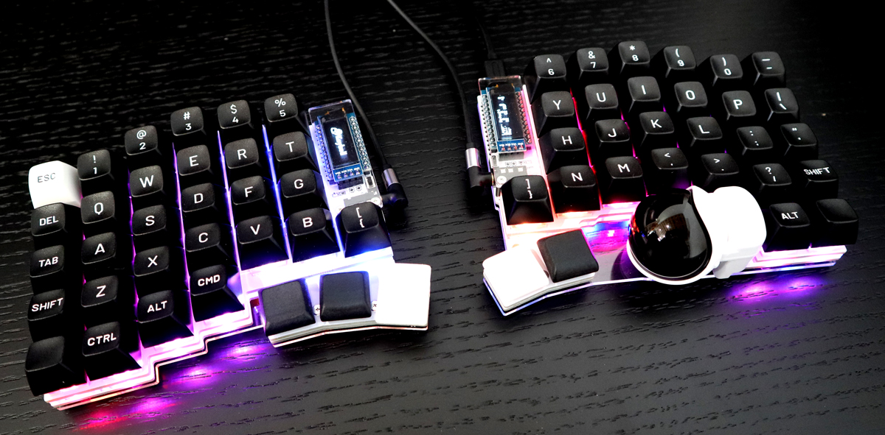

## 【目次】

  - [１．部品確認](#１部品確認)
    - [1-1．キット同梱品](#1-1キット同梱品)
    - [1-2．組立前にお客様自身で準備いただく部品](#1-2組立前にお客様自身で準備いただく部品)
    - [1-3．組立後でも取り付けられる部品とオプション](#1-3組立後でも取り付けられる部品とオプション)
  - [２．準備](#２準備)
    - [2-1．必要な工具](#2-1必要な工具)
    - [2-2．ファームウェア](#2-2ファームウェア)
  - [３．実装](#３実装)
    - [3-1．はんだ付けの前に](#3-1はんだ付けの前に)
    - [3-2．ダイオードの取り付け](#3-2ダイオードの取り付け)
    - [3-3．キーソケットのはんだ付け](#3-3キーソケットのはんだ付け)
    - [3-4．ジャンパのはんだ付け](#3-4ジャンパのはんだ付け)
    - [3-5．TRRSソケット・タクトスイッチ・4連ピンソケット](#3-5TRRSソケットタクトスイッチ4連ピンソケット)
    - [3-6．ProMicroのはんだ付け](#3-6promicroのはんだ付け)
    - [3-7．ProMicroの書き込みと動作確認](#3-7promicroの書き込みと動作確認)
    - [3-8．LED（オプション）のはんだ付け](#3-8ledオプションのはんだ付け)
  - [４．ボール読み取り基板の組み立て](#４トラックボール読み取り基板の組み立て)
  - [4-1．センサーのはんだ付け](#4-1センサーのはんだ付け)
    - [4-2．L字コンスルーのはんだ付け](#4-2l字コンスルーのはんだ付け)
  - [５．左手側の左右判定ジャンパーをはんだ付け](#５左手側の左右判定ジャンパーをはんだ付け)
  - [６．トッププレートのカット（オプション）](#６トッププレートのカットオプション)
  - [７．組み立て](#７組み立て)
    - [7-1.保護プレートの取り付け](#7-1保護プレートの取り付け)
    - [7-2.トッププレートの組み立て](#7-2トッププレートの組み立て)
    - [7-3.ボトムプレートの組み立て](#7-3ボトムプレートの組み立て)
  - [８．トラックボール取り付け](#８トラックボール取り付け)
    - [8-1.ボール読み取り基板差し込み](#8-1ボール読み取り基板差し込み)
    - [8-2.トラックボールケースの組み立て](#8-2トラックボールケースの組み立て)
    - [8-3.トラックボールケース装着](#8-3トラックボールケース装着)
  - [９．総仕上げ](#９総仕上げ)
  - [１０．正規ファームウェアの書き込み](#１０正規ファームウェアの書き込み)
  - [１１．Keyballの使い方♪](#１１keyballの使い方)

## １．部品確認

キットが届きましたらキット同梱品がすべて入っていたかご確認ください。

### 1-1．キット同梱品

Keyball61 標準キットの同梱品は下記になります。

もし12Pコンスルーの代わりにProMicro用ピンヘッダ＋ピンソケットが同梱されていた場合には、[【こちら】](https://github.com/Yowkees/keyball/blob/main/keyball61/doc/rev1/buildguide_jp.md#1-1%E3%82%AD%E3%83%83%E3%83%88%E5%90%8C%E6%A2%B1%E5%93%81)のビルドガイドをご利用ください。

| 名前 | 数 | 備考 |
|:-|:-|:-|
| ミドルPCB(左右) | １組 | |
| トップPCBプレート(左右) | １組 | |
| ミドルアクリルプレート(左右)| １組 |メインと親指部のセット |
| ボトムアクリルプレート(左右) | １組 | |
| ProMicro保護プレート | ２枚 | |
| トラックボール保持ケース白(上下) | １組 | |
| Φ2 セラミックボール | １個 | 予備用 |
| トラックボール読取り基板 | １枚 | |
| L字コンスルーピン(7ピン) | １個 | |
| トラックボール読取りIC | １個 | |
| 読取りIC用レンズ | １個 | |
| 平頭タップネジ M1.7 | ２本 | |
| 小頭タップネジ M1.7 | ２本 | |
| TRRSジャック | ２個 | |
| タクトスイッチ | ２個 | |
| ストレートコンスルーピン(12ピン) | ４本 | |
| ダイオード（表面実装タイプ） | ７８個＋ | |
| Kailh PCBソケット CherryMX用 | ６１個＋ | |
| Kailh PCBソケット choc用| ５個 |親指ロープロ改造で使用 |
| OLEDモジュール | ２枚 | |
| 4連ピンヘッダ  | ２つ | |
| 4連ピンソケット | ２つ | |
| スペーサー M2 7mm | １７本＋ | |
| スペーサー M2 9mm | ４本 | |
| スペーサー M2 4mm | ５本 |親指ロープロ仕様で使用 |
| ネジ M2 3.5mm | ４２本＋ | |
| クッションゴム | ８個 | |

※片手セットをご購入の場合は、キットに同封の部品リストにて同梱品をご確認ください。

### 1-2．組立前にお客様自身で準備いただく部品

| 名前 | 数 | 備考 |
|:-|:-|:-|
| ProMicro | ２個 | 安価なものやUSB Type-C対応のもの等選べます |
| CherryMX互換キースイッチ | ６１個 | 親指ロープロ仕様なら５６個 |
| ロープロファイルキースイッチ | ５個 | 親指ロープロ仕様とする場合のみ |
| 直径34mmトラックボール | １個 | 動作確認で使用します |
| TRS(3極)ケーブル | １本 | TRRS(4極)ケーブルでも可 |
| Micro USBケーブル | １本 | ご購入いただいたProMicroに対応するもの |

### 1-3．組立後でも取り付けられる部品とオプション

| 名前 | 数 | 備考 |
|:-|:-|:-|
| キーキャップ | ６１個 | 1u ６１個 |
| ロープロファイルキーキャップ | ５個 | 親指ロープロ仕様のみ　1u ５個 |
| YS-SK6812MINI-E | ７１個 | ※SK6812MINIは使用できません |

## ２．準備

### 2-1．必要な工具

Keyball61の組み立てには下記の工具が必要です。

| 名前 |
|:-|
| はんだごて(LEDを実装する場合は温度調整可能なもの) |
| はんだ(LEDを実装する場合は低融点のものが有効) |
| ０番＋精密ドライバー |
| ピンセット |
| 150番手くらいの紙やすり |

### 2-2．ファームウェア

Keyball61を動作させるには、ご購入いただいたProMicroへのファームウェアの書き込みが必要です。
すでにビルド済みのファームウェアがダウンロードできますので、ProMicroへの書き込みソフト『QMK Toolbox』だけ準備できればKeyball61を使用できます。QMK Toolboxについては [Corneのファームウェア](https://github.com/foostan/crkbd/blob/master/doc/firmware_jp.md) の記事に簡潔にまとめられていますのでリンク先前半の説明を読んでQMK Toolboxを準備しておいてください。  

書き込みについてはこの後の[3-7章](#3-7promicroの書き込みと動作確認)でテスト用のファームウェアの書き込み、[１０章](#１０正規ファームウェアの書き込み)で製品版ファームウェアの書き込みについて詳しく説明しています。

## ３．実装

ここからはんだ付け作業に入ります。  
PCBはリバーシブルになっているので、最初にどちらを左手用/右手用にするか決めます。  

赤丸で示した、PCBが欠けている部分にトラックボールがつきます。  
右手親指でトラックボールを操作するなら下写真のような配置になります。  

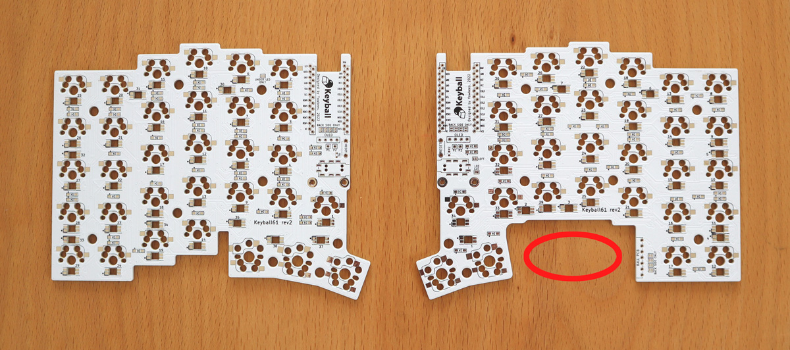

左手親指でトラックボールを操作する場合は下写真のような配置です。 

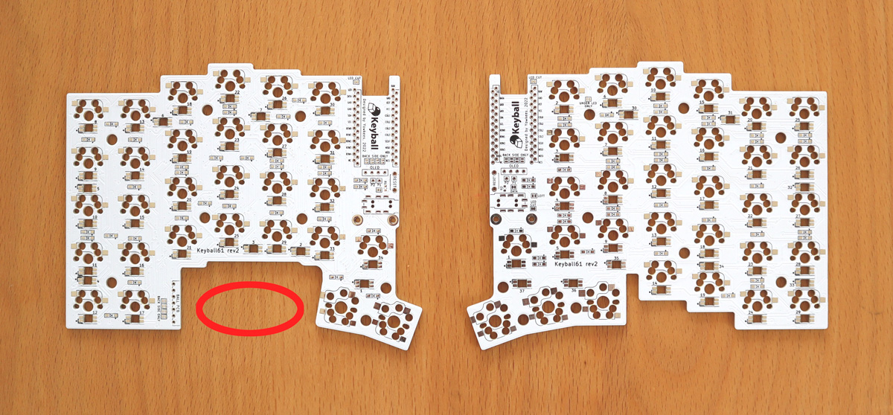

本ビルドガイドでは右手にトラックボールをつける仕様で説明します。  
下記のようにPCBを置き、ミス防止のため表面にマスキングテープを貼ります。

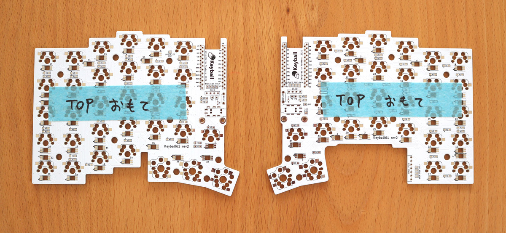

### 3-1．はんだ付けの前に
半田ごての”こて先”は竹槍の先端のような形状のものだと平面にはんだを乗せたり、余分なはんだを”すくい取る”事が出来るので使いやすいです。

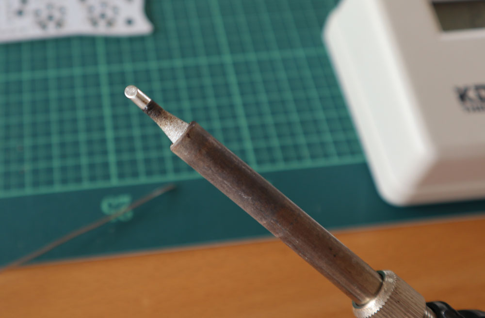

### 3-2．ダイオードの取り付け
それではダイオードを順にはんだ付けしていきます。  
ダイオードはすべて【裏面】にはんだ付けします。  
  
ダイオードのシルクマークは下写真の矢印で示したマークで、左右合計で63個あります。  
ダイオードには極性がありますので、正しい向きで取り付けてください。向きは部品上の直線とシルクマーク内の矢印の先についている直線が一致する方向です。  
  
下写真をよく見て向きを確認してください。  
同一基板上のダイオードの向きはすべて同じ向きで配置されています。半田付けを進める中で回りのダイオードと同じ向きになっているか確認しながら行ってください。

ダイオードはトラックボール有り側基板には３４個、トラックボール無し側基板には３７個半田付けします。（rev1基板の場合は３０個と３３個です）
あらかじめ数を数えて、極性を揃えて並べておくと、取り付け忘れに気づきやすいのでお勧めします。シルクには下記写真の赤で示すような黒点を付けました。ですので、ダイオードを半田付け後にも極性確認を行う事ができます。

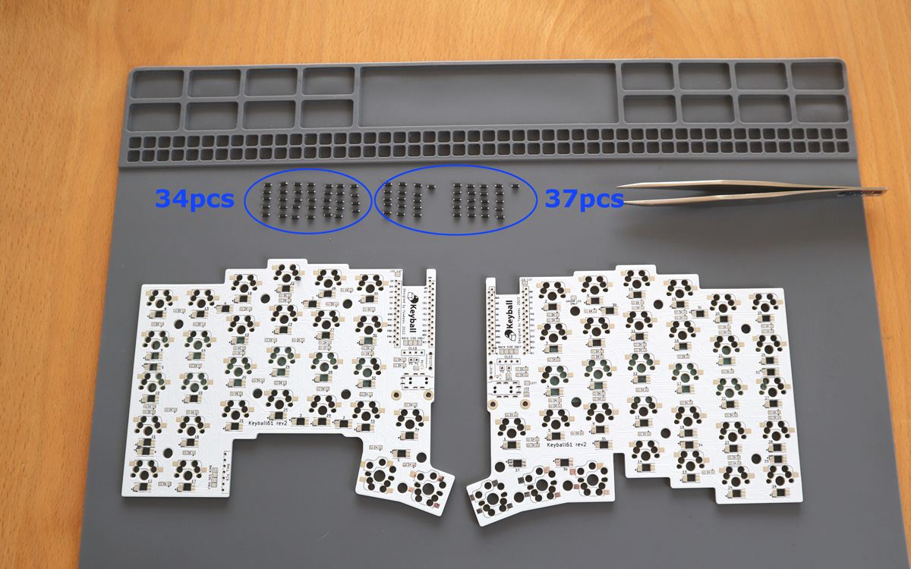

ダイオードのシルクには下記写真の赤で示すような黒点を付けました。ですので、ダイオードを半田付け後にも極性確認を行う事ができます。

それでは半田付け開始です。まず、ダイオード用パッドの片側にはんだを盛ります。

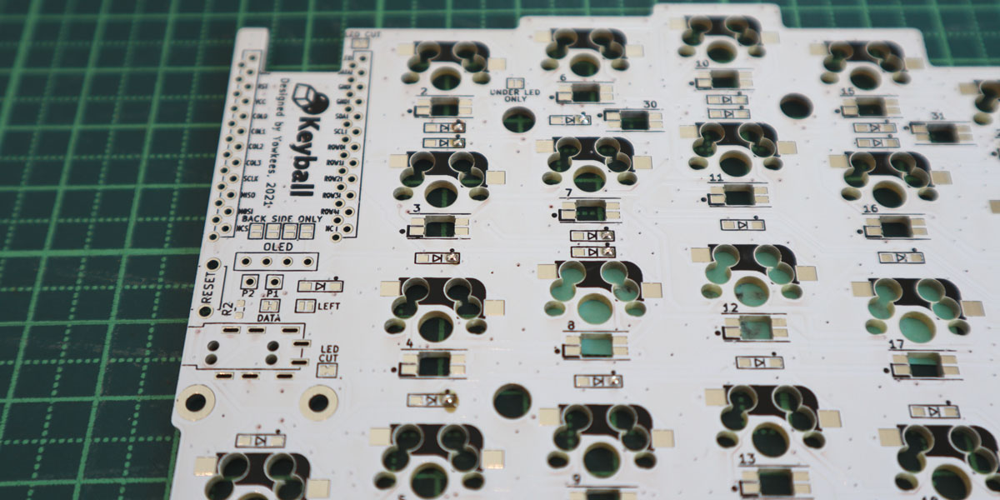

ピンセットでダイオードを掴み、事前に盛ったはんだを溶かしながらダイオードを固定します。

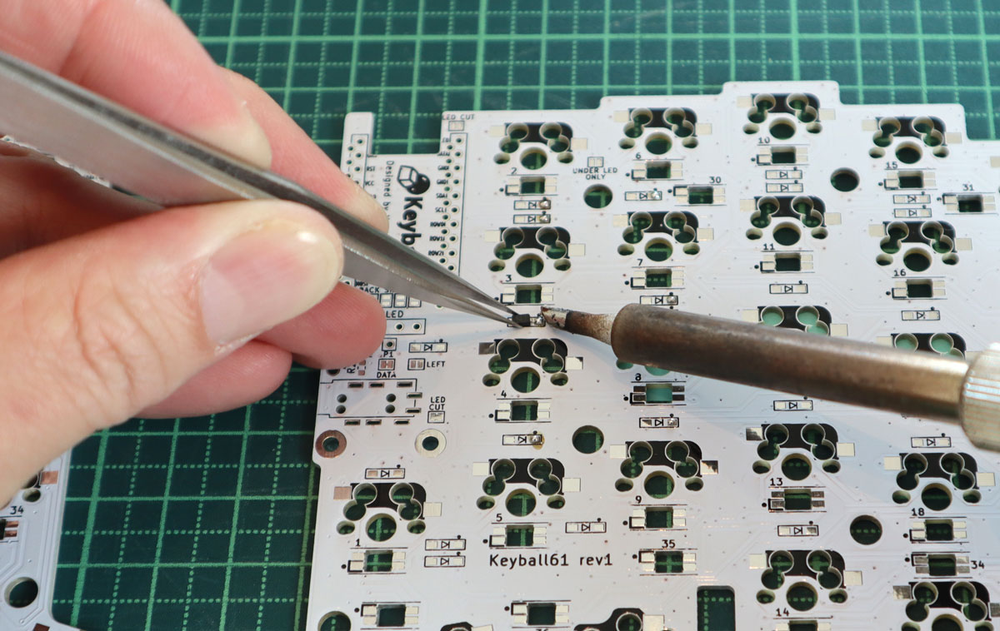

基板を180度回転させてダイオードの反対側の足へもはんだを流します。
最後に両方の足をこて先で触り、ダイオードが脱落しなければ両足とも半田付けされています。

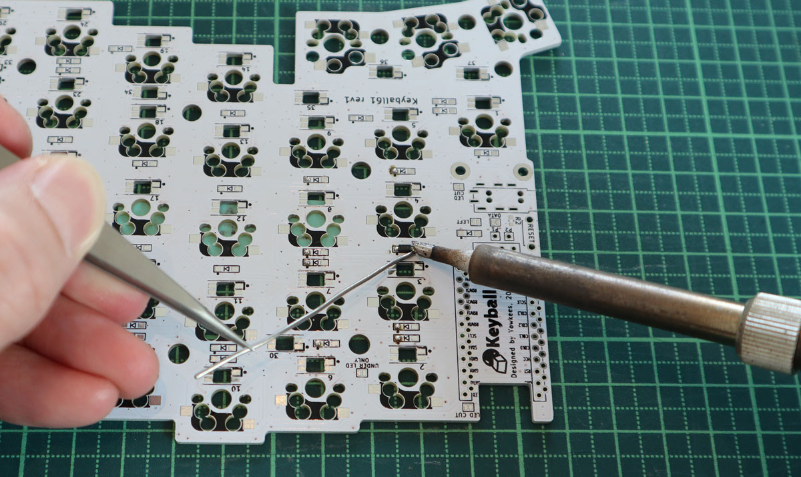

左右合計で７１個のダイオードを取り付けます。
下写真で緑丸で示したダイオードが変則的な位置にあるため半田付け忘れが多いダイオードです。この箇所に取り付け忘れがないか再度確認をお願いします。

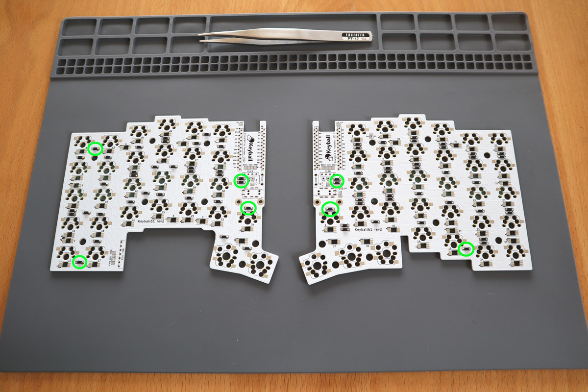

### 3-3．キーソケットのはんだ付け
キーソケットもダイオードと同様に【裏面】に半田付けします。

キーソケットをシルクマークと形状が合うようにセットしてはんだ付けします。  
シルクからはみ出すようであれば方向が違います。正しい向きを下記写真で確認してください。

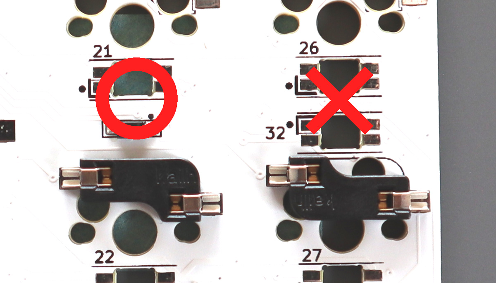

親指ロープロ仕様にて組み立てる場合には、親指キーとなる箇所（左右で５キー）にロープロファイル用ソケットを半田付けして下さい。このロープロソケットにも向きがあります。

下記写真にて方向を確認してください。黒い樹脂部分が八角形に近くなっている端子がスイッチの真ん中付近にくる方向が正解です。

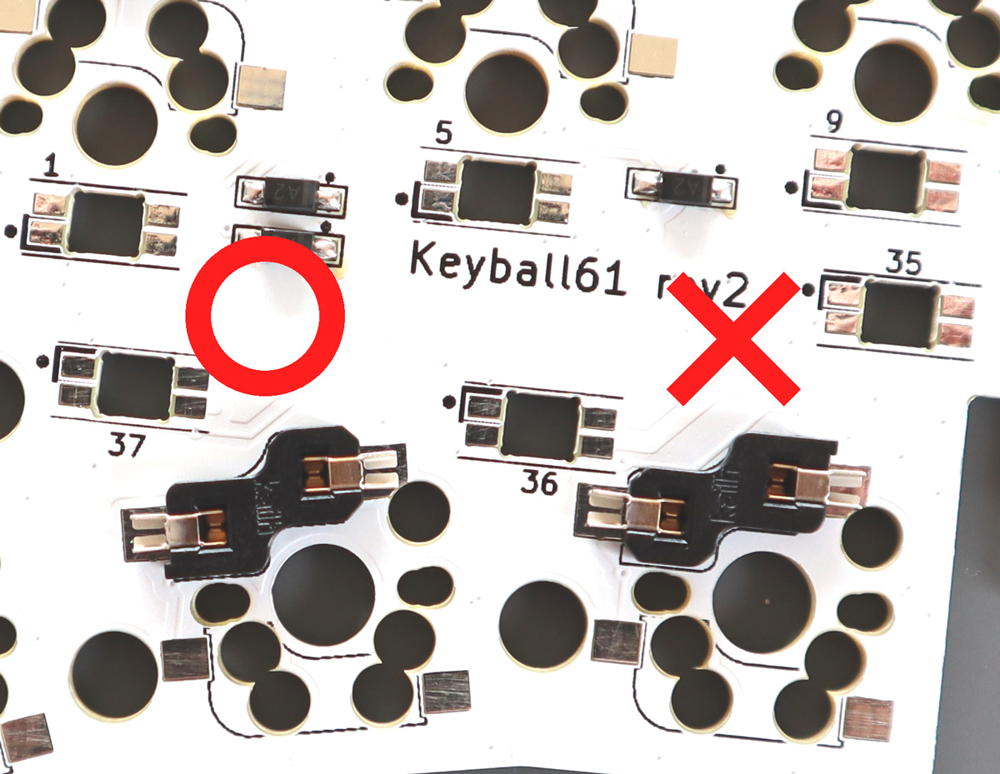

半田付けは、青丸で示すように事前にソケット用パッドの片側に半田を盛っておきます。

ソケットをはめて上からピンセットで抑えて端子の横からはんだを少し載せたこて先を当てると、はんだが溶けてソケットが沈み込みます。  
経験上、この方法が一番テンプラ（接続不良）しにくいです。  

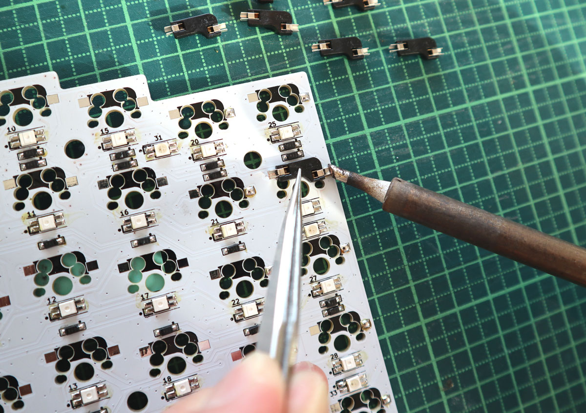

基板を180度回転させて反対側の端子も半田付けします。

左右合わせて６１個はんだ付けして完了です。親指キーのPCBソケットはCherryMX互換ソケットかロープロソケットのどちらかだけでも構いません。写真では両方付けています。

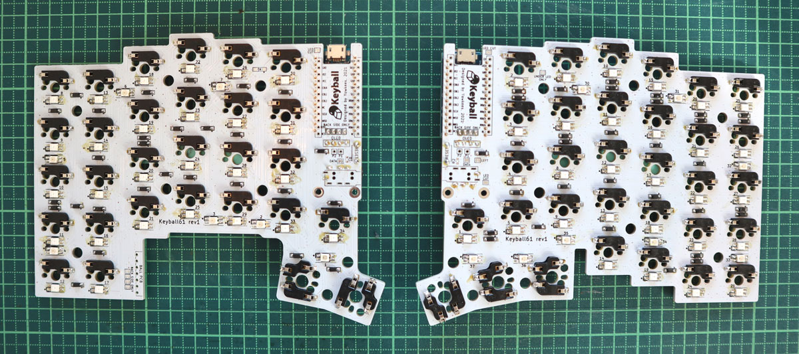

### 3-4．ジャンパのはんだ付け
OLEDモジュールを動作させるためにジャンパをショートさせる必要があります。

ジャンパの半田付けは __【裏面のみ】__ に行います。  
"Back Side Only"の表示があり、左右の基板に各【４個ずつ】あります。  
パッドをこて先で温めてから、はんだを溶かすとブリッジできます。

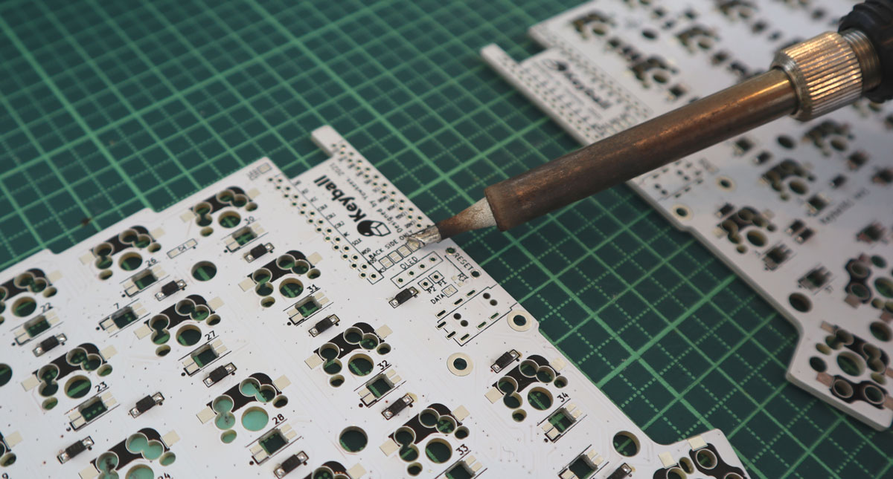

半田付けに自信のない方やブリッジ作業が苦手という方は、いきなりブリッジさせようとせずに、下写真のようにまずは8個のパッドに半田を付ける事を行ってみてください。

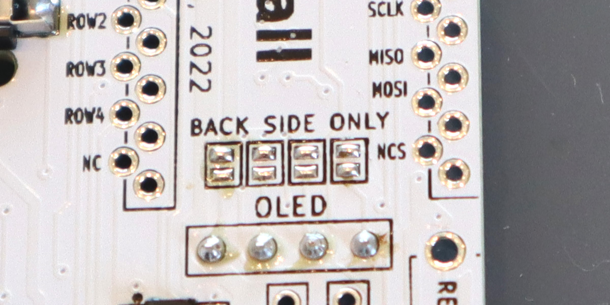

ここに半田を追加することで、楽にブリッジさせられると思います。

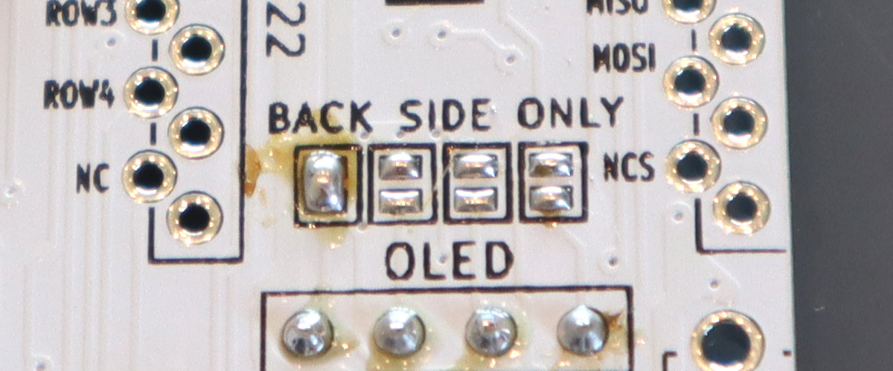

はんだの鮮度が落ちる（何度も温め直す）と表面張力が落ちてうまくブリッジできません。  
一度はんだを払ってしまい、はんだやフラックスを足してやり直してください。
すべてうまくブリッジできると下写真のようになります。

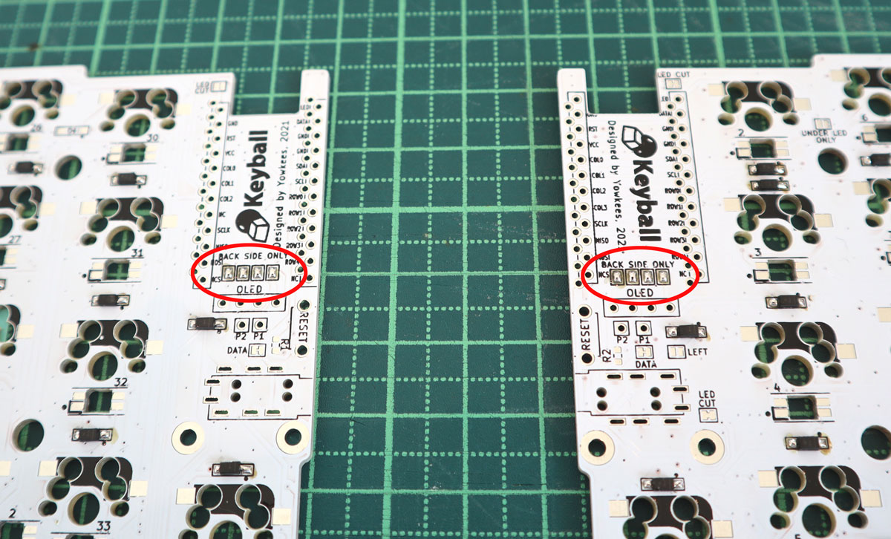

この他にもジャンパがいくつかあると思いますが、これらは追って説明しますので、ひとまず左右４箇所ずつだけ半田付けしてください。

### 3-5．TRRSソケット・タクトスイッチ・4連ピンソケット
下記写真の部品をのはんだ付けします。  
今度はすべて【表面】に取付けますのでご注意ください。  

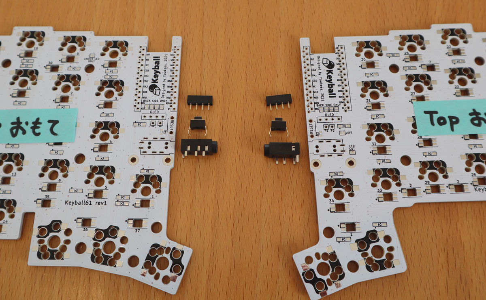

部品が浮いてしまうのが心配であれば、マスキングテープ等で固定してはんだ付けします。

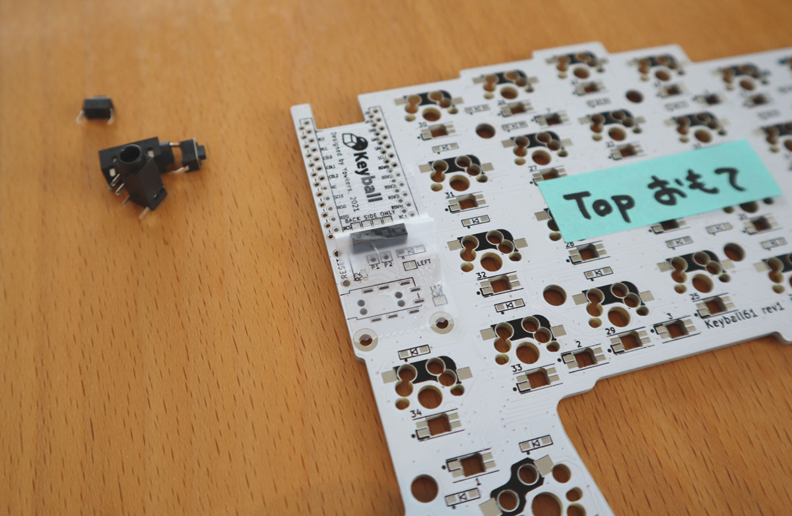

すべて取り付けると下写真のようになります。

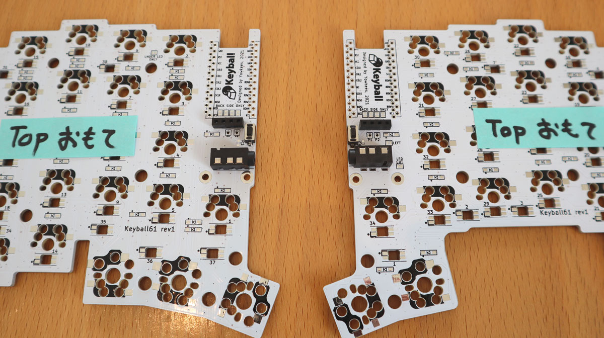

### 3-6．ProMicroのはんだ付け
ProMicroは下記写真のコンスルーピンを使用してはんだ付けすることで、故障時に交換が容易になります。コンスルーピンには取付け方向がありますので写真をよく見て作業してください。

もし12Pコンスルーの代わりにProMicro用ピンヘッダ＋ピンソケットが同梱されていた場合には、[【こちら】](https://github.com/Yowkees/keyball/blob/main/keyball61/doc/rev1/buildguide_jp.md#3-6promicro%E3%81%AE%E3%81%AF%E3%82%93%E3%81%A0%E4%BB%98%E3%81%91)のビルドガイドをご利用ください。

まずコンスルーピンを基板【表面】に差し込みます。

シルクの四角枠に合うようにコンスルーを差し込んでください。シルクの黒枠がコンスルーとずれているようであれば差し込む穴が間違っています。

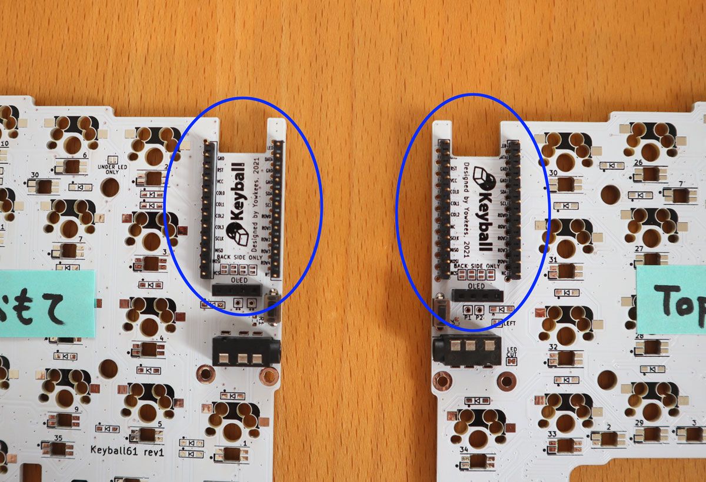

差し込んだコンスルーピンにProMicroを挿入します。  
しっかり最後まで差し込んだ状態でProMicro側のみはんだ付けします。
基板に差し込んだ状態ではんだ付けすることで、コンスルーピンが斜めに取り付けられてしまうことを防げます。

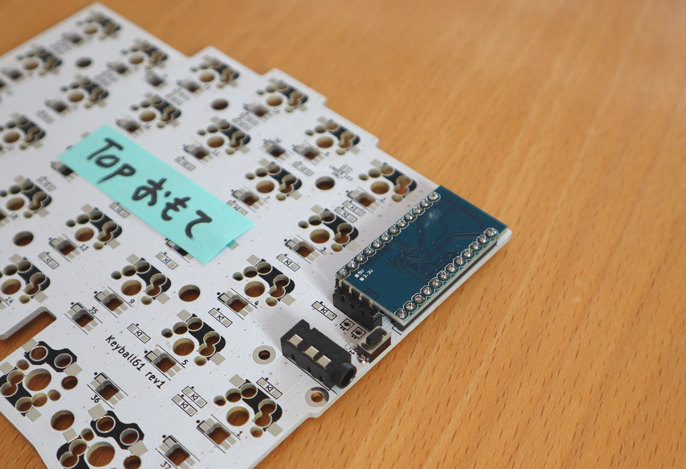

左右の基板には標準でOLEDが搭載できます。  
4連ピンソケットに4連ピンヘッダを挿入してOLEDモジュールを載せます。
そして、4ピンのうちのひとつだけをはんだ付けします。  

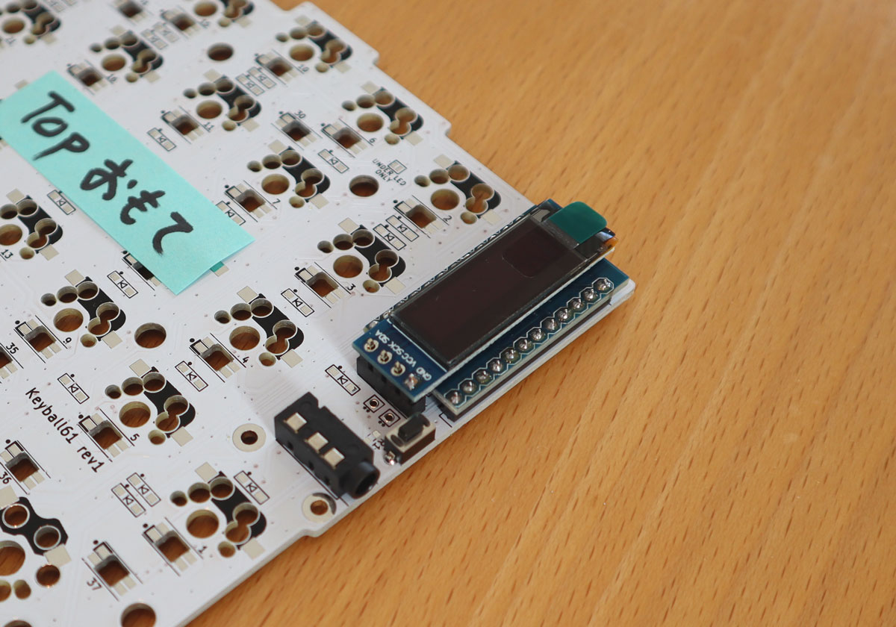

１つだけ半田付けしたピンの半田を溶かしながらOLEDモジュールを上から押して浮かないようにします。またProMicroと並行になるように調整すると見栄えが良くなります。

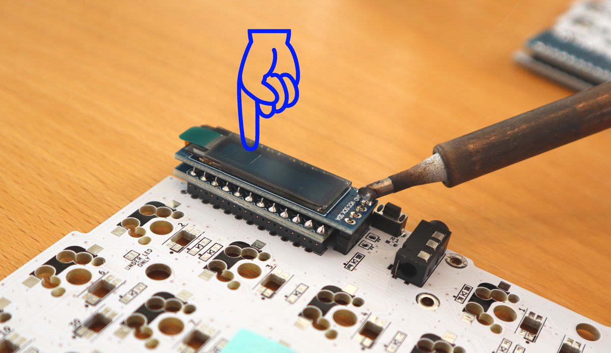

位置が決まったら残り3ピンをはんだ付けします。

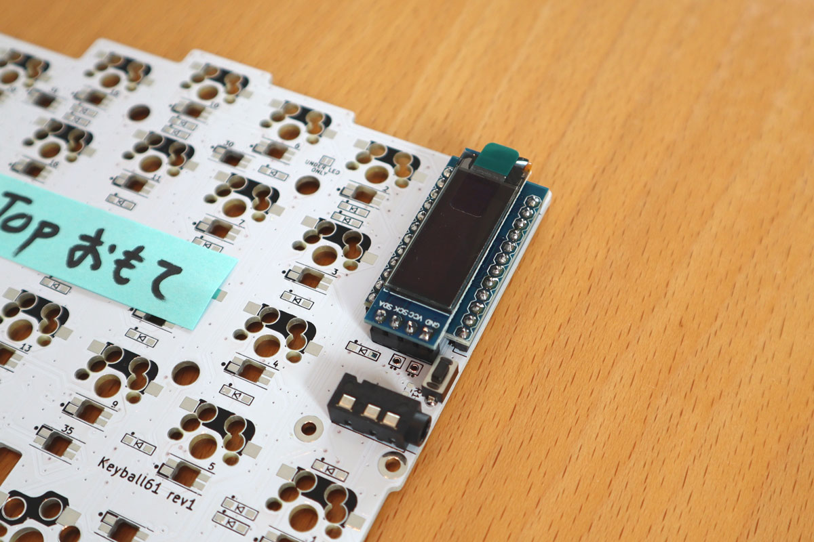

### 3-7．ProMicroの書き込みと動作確認
それではまずテスト用のファームウェアをProMicroに書き込みましょう。

テスト用ファームウェアは動作確認しやすいようにキーマップが簡潔なのと、RGB LEDが赤→緑→青と順に点灯するため、はんだ不良を発見しやすいです。
今回はLEDはんだ付けを見送っている場合など、テスト用ファームウェアが必要無いと思われる方は[１０章](#１０正規ファームウェアの書き込み)の正規のファームウェアをここで書き込んでも構いません。  
  

Keyball61のファームウェアは、トラックボールを右手と左手のどちらに載せた場合でもファームウェアは共通です。[REMAPに登録してあるKeyball_test.hex](https://remap-keys.app/catalog/RZSU1CrvEW4lns0ww5BM/firmware) を書き込み(FLASH)してください。
上記リンクにあるFLASHボタンを押すと、書き込み方法の説明が表示されます。

USBケーブルを接続しているのにキーボードが認識されない場合は、半田付けしたRESETスイッチを素早く2回押すと認識されると思います。

※必ず左右両方のPro Microに同じhexファイルを書き込んでください。

  Keyball61のファームウェアを直接編集してご自身でビルドしたい場合は、 [こちらのリポジトリ](https://github.com/Yowkees/keyball/tree/main/qmk_firmware/keyboards/keyball)にソースファイルがありますのでダウンロードしてご活用ください。

書き込みが完了したら下写真のようにキースイッチのパッドをピンセットでショートして動作確認します。テキストエディタに文字が入力されることを確認します。キーボードの左右が反転している場合がありますが、現状は問題ありません。ひとまず何かしらの文字が入力されてProMicroが動作しているかだけご確認ください。すべてのキーを試す必要はまだありません。
早い段階で動作確認をすることで問題の切り分けが楽になります。

※ファームウェアの書き込みは必ず左右両方のPro Microに対して行ってください。

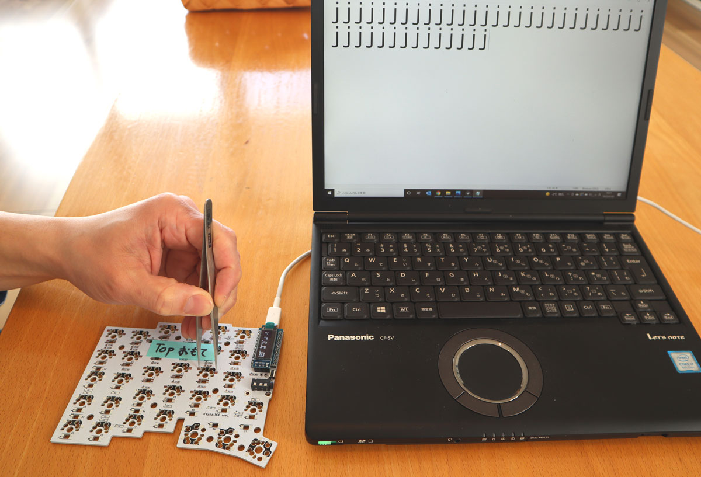

### 3-8．LED（オプション）のはんだ付け

LEDはすべて【裏面】に半田付けするのでご注意ください！！

LED（YS-SK6812MINI-E）はオプションになります。左右で計７１個取り付け可能です。  
ただしLEDは非常に熱に弱く、こて先温度を220度～280度に調整して行ってください。  
こて先の温度が低いためパッドに熱が伝わらず半田がテンプラ（接続不良）しやすいです。  
LED無しでもキーボードは使用できますし、すべてのLEDを点灯させるのは難易度が高いのでまずはLEDなしで完成させることをおすすめします。後からでもLEDを追加できます。  
  
YS-SK6812MINI-Eの４ピンのうち切り欠きがある足と、マーキングされているパッドを合わせてLEDを載せて半田付けします。

LEDには上向きに付けるものと下向きに付けるものが混在しますが、下写真のようにピンの切り欠きとマーキングを合わせてさえいれば、上下は自動的に合います。

一度に４ピンすべてのはんだ付けをすると部品の温度が上がり壊れやすいので、２ピンづつくらいで時間をあけてはんだ付けしてください。そのために１０個ほどのLEDを一度に載せて、一度はんだを当てたら次のLEDの半田付けに移るようにします。こうすると１つのLEDに熱を加え続けることを防げます。

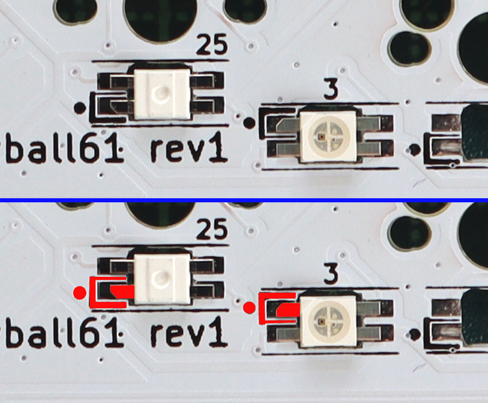

はんだ付けが完了したらUSBケーブルを接続して、点灯を確認します。 

LEDは直列に配線されているので、途中までしか光らない場合は修正が必要です。

例として下写真を見てください。
シルクのLED番号を見ると、12番のLEDまでは点灯しましたが、13番以降のLEDが点灯していません。この場合、【12番か13番】のLEDの半田付けに問題がある可能性が高いのでそれらのLEDの半田付けをやり直してください。
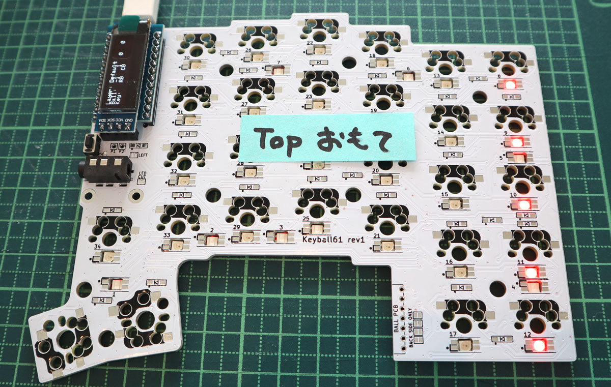

点灯確認と半田付け修正を繰り返して、すべてのLEDが点灯するようにします。

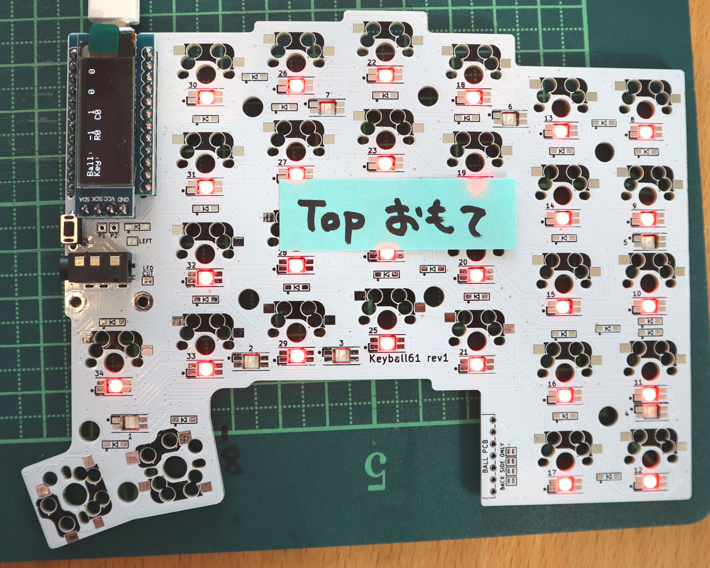

## ４．トラックボール読み取り基板の組み立て
下写真の基板（以下、ボール基板）と光学センサーを準備します。

※センサーや基板の品質確認のため、はんだ付け済のボール基板が届く場合があります。その時にはこの工程は飛ばして、4-2章のL字コンスルーはんだ付けに進んでください。

  

## 4-1．センサーのはんだ付け  

センサーICはボール基板の部品が実装されていない裏面から差し込みます。
センサーの極性を間違えると、修理がとても大変です！正しい向きで、正しい方向から挿入しているかしっかりと確認してから半田付けしてください！  
ICの１ピンを示すくぼみと基板の【1pin】のシルクを合わせます。

ICを裏から見るとこのような方向です。表面実装部品が実装されている表面側（Keyballロゴの無い面側）から全ピンをはんだ付けしてください。

ピンセットを使って保護シール【２枚】をはがします。

保護シールをはがした面側にセンサーレンズを取り付けます。レンズには方向があります。方向が違うとレンズの細いピン2本が折れてしまう恐れがあるため方向をしっかりとご確認ください。  
レンズ手前に下写真矢印のような突起があり、これが上側にくるように取り付けます。

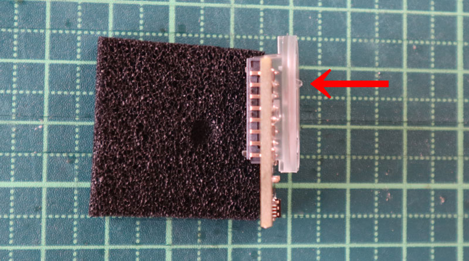

レンズとICの方向が合えば、レンズのピン2本がICに無理なく差し込めるはずです。ゆっくりと差し込んでください。

### 4-2．L字コンスルーのはんだ付け
次にL字コンスルーピンをトラックボールを搭載する基板の【表面】に取付けます。  
L字コンスルーにも方向があります。
ピンがU字型になっていない方をミドル基板に差し込んで半田付けします。

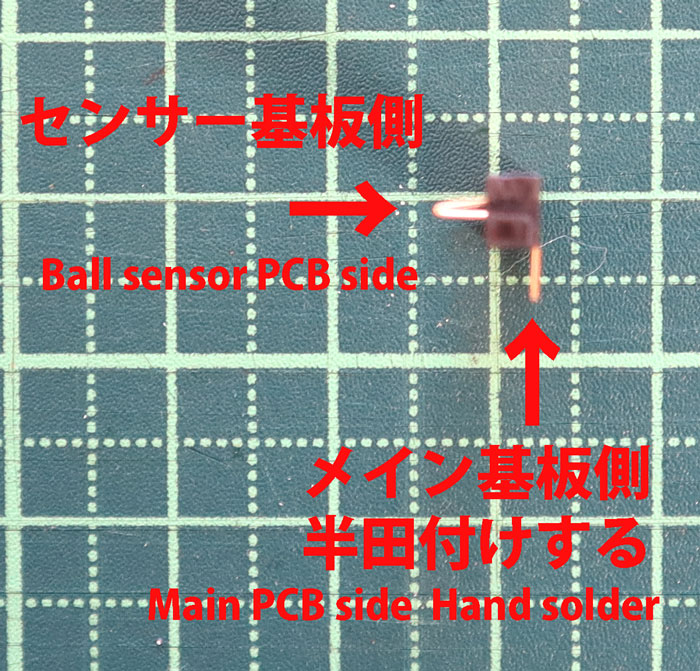

部品が浮かないようにマスキングテープ等を貼って裏面からはんだ付けしてください。

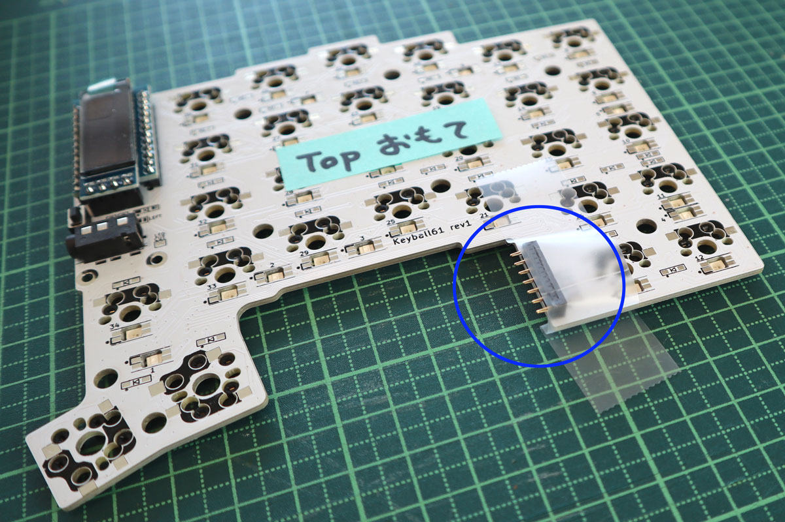

次に光学センサー用信号線のジャンパ４個を半田付けします。
いま半田付けしたコンスルーの近くにジャンパがありますので、これを【裏面のみ】半田を盛って下写真のようにショートさせてください。

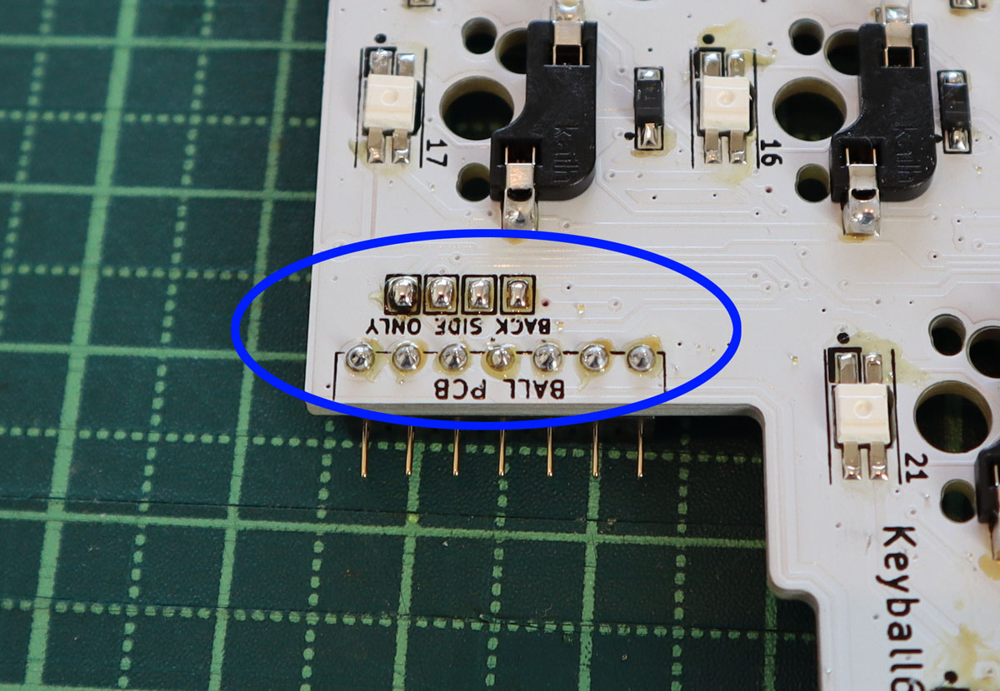

## ５．左手側の左右判定ジャンパーをはんだ付け 

Keyball61の標準ファームウェアには左右自動判定機能がついています。判定のために【左手側の基板だけ】に１個所ジャンパーをはんだ付けします。  

左手側基板を裏から見ると下写真赤丸部に[LEFT]というシルクがあります。この隣のジャンパを半田付けしてショートさせてください。

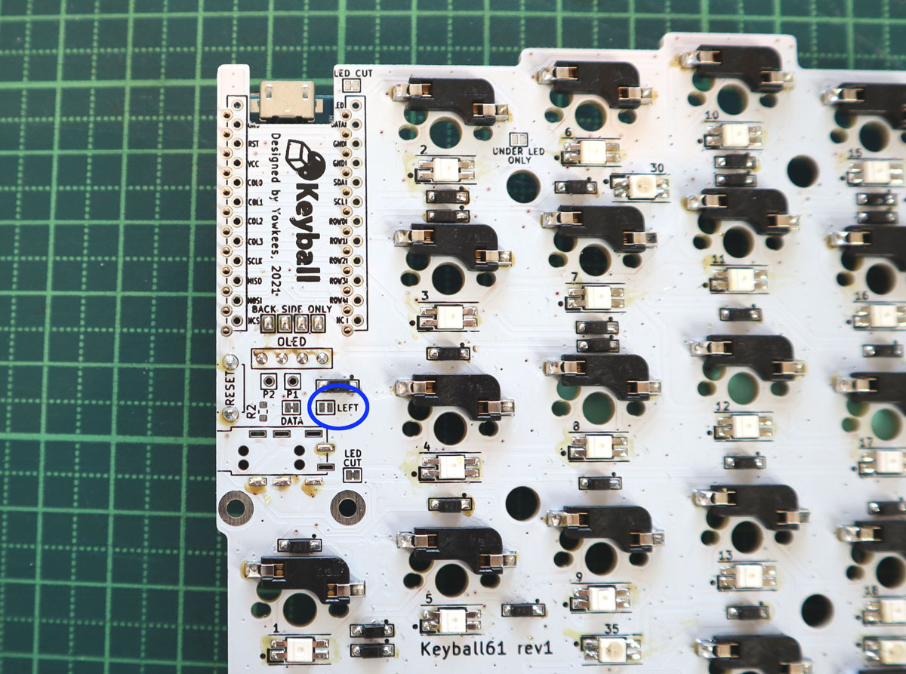

左手側にトラックボールを載せる場合位置が少し異なり、LEFTジャンパは下写真の位置になります。

必ず【左手側の基板だけ】にジャンパーします。

以上ではんだ付け作業は完了です。

余談ですがはんだごての電気を落とす前に、こて先にたっっぷりとはんだを付けておきましょう。次回使用するときにこのはんだを落とせば、ピカピカのこて先で作業を再開できますよ！

## ６．トッププレートのカット  

Keyball61はトッププレートの親指キー部分のミシン目を切り離して組み立てる必要があります。
切り取るためには、カッターを使用して表面と裏面のミシン目部分に切り込みを入れてから折って切り離します。

切り離した断面は150番手くらいの紙やすりで整えてください。

## ７．組み立て 

### 7-1.保護プレートの取り付け  

ミドル基板にProMicro保護プレートを取り付けます。
まず9mmスペーサをねじ止めします。

アクリル保護プレートをスペーサにねじ止めします。

トラックボール有り側も無し側も保護プレートの形状は共通です。表裏もありません。

  

### 7-2.トッププレートの組み立て  

トッププレートの【裏面】に7mmスペーサをねじ止めします。

親指をロープロファイル仕様で組み立てる場合には、親指キー用トッププレートには4mmスペーサを取り付けます。

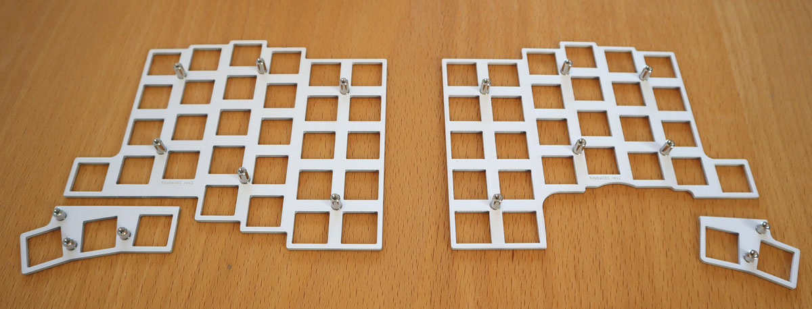

トッププレートの四隅と親指用プレートにキースイッチをはめ込みます。

こうしておくとプレート同士の位置決め精度が上がります。

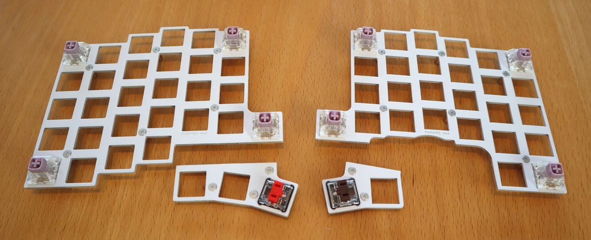

トッププレートとミドルアクリルプレートのねじ穴を合わせ、プレート同士を重ねます。

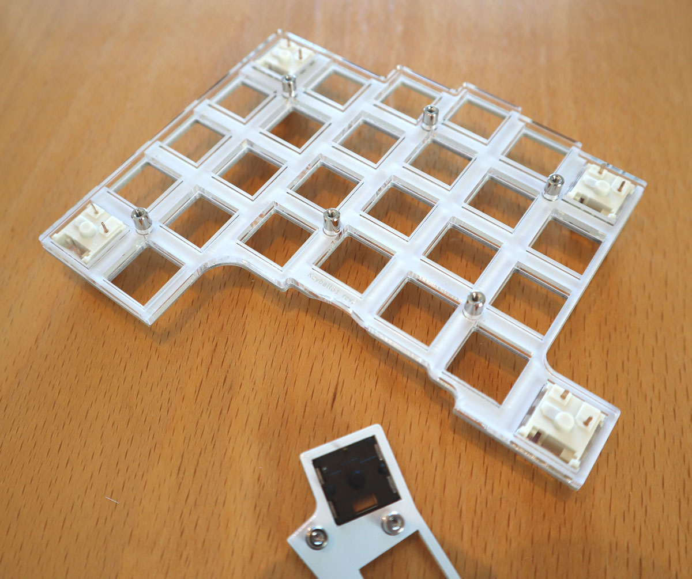

次に半田付けしたミドル基板もネジ穴を合わせ、キースイッチの端子がしっかりキーソケットに入ることを確認しながら重ねます。

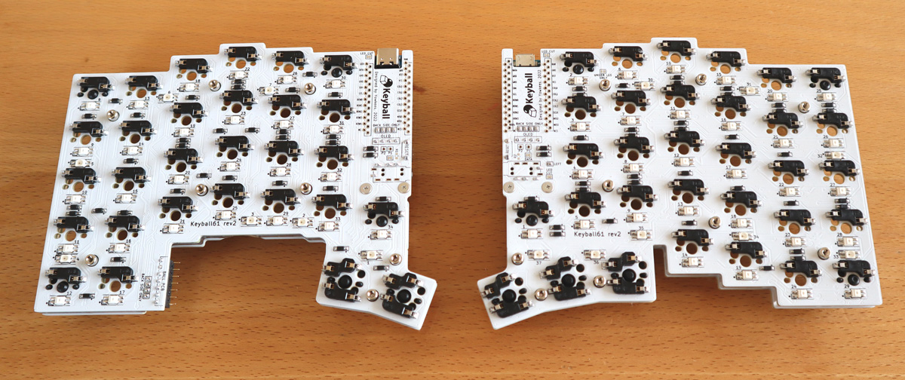

### 7-3.ボトムプレートの組み立て  

※以前までドーナツ型のアクリルスペーサがありましたが、アクリル厚みのバラつきにより効果が得られないため廃止しました。アクリルスペーサがキットに入っていた場合には廃棄してください。

アクリルボトムプレートの保護シートを剥がし、本体裏面に重ねてねじ止めします。
最後にキーボード裏の四隅にクッションゴムを張り付けてください。

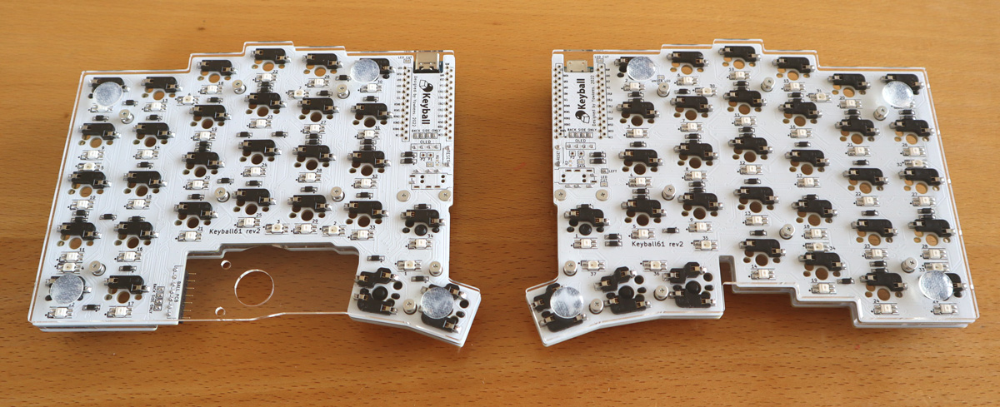

## ８．トラックボール取り付け 

### 8-1.ボール読み取り基板差し込み  

組み立てたトラックボール読み取り基板を７ピンコンスルーへ差し込みます。わかりやすいように斜めにしていますが、基板は垂直にして差し込みます。

ボール基板が垂直に立ちました。

### 8-2.トラックボールケースの組み立て  

トラックボールケースには事前にセラミックボール3個が固定されています。万が一セラミックボールが脱落している場合にはお手数ですが予備のセラミックボールを適当なボンドで固定してください。  
セラミックボールの予備は今後ボールを紛失した時のために保管しておいてください。

ケースを振ってみて、セラミックボールが脱落しないか確認してください。

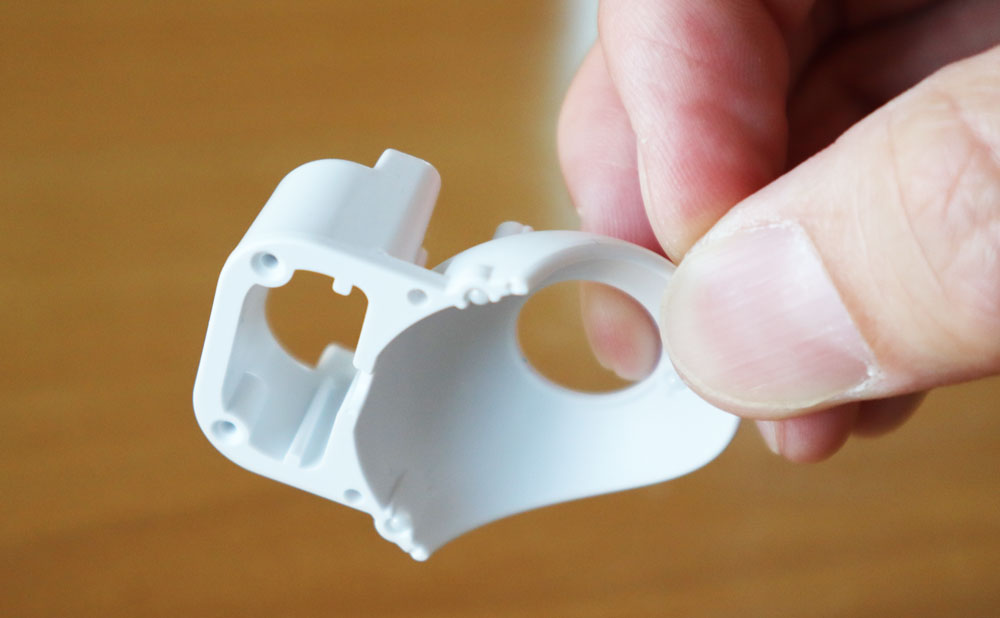

ケース下の穴へ、ケース上のピン２本が挿入できます。  
上下からゆっくり力を入れて結合します。（ぴったりと結合しなくてもこの後のねじ絞めでくっつきますので大丈夫です。）

M1.7のタッピングねじをつけます。キットにはねじ頭が【小さいねじ】と【平らなねじ】が同梱されていますが、そのうちの【頭の小さいねじ】を使用します。

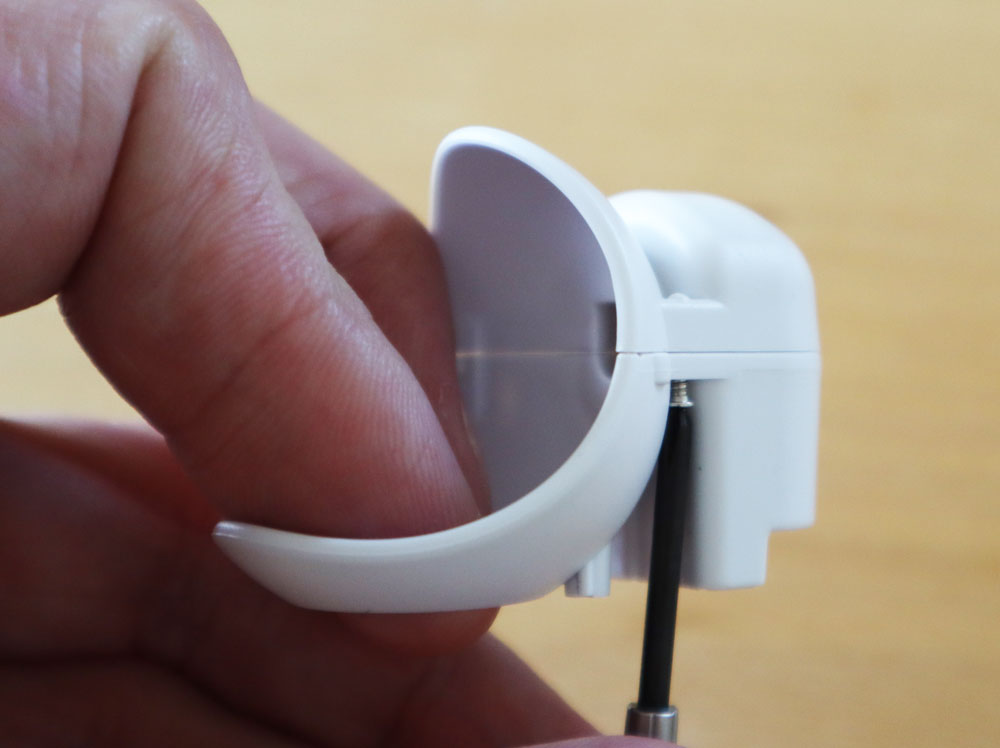

ケース裏から見て、この２個所をねじ止めします。締め付けすぎにご注意ください。

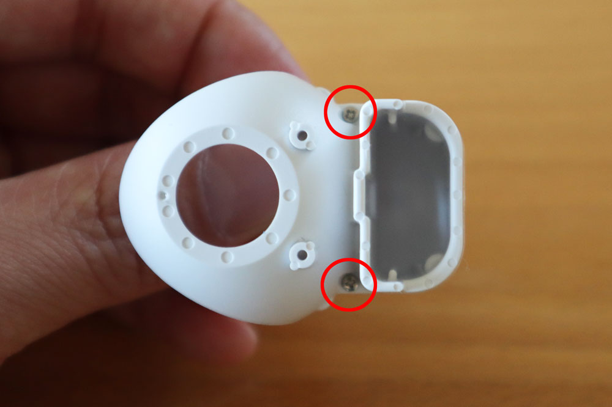

### 8-3.トラックボールケース装着  

完成したケースを本体に取付けます。ケース裏側のセンサー収納部にボール基板が入ります。  
矢印で示すボール基板がケース中央くらいにくるようにしながら、上からゆっくりとはめます。引っ掛かりがある場合、無理に押し込まず、一度引き抜いて再度入れ直してください。

それほど力を入れなくても最後まで入るはずです。

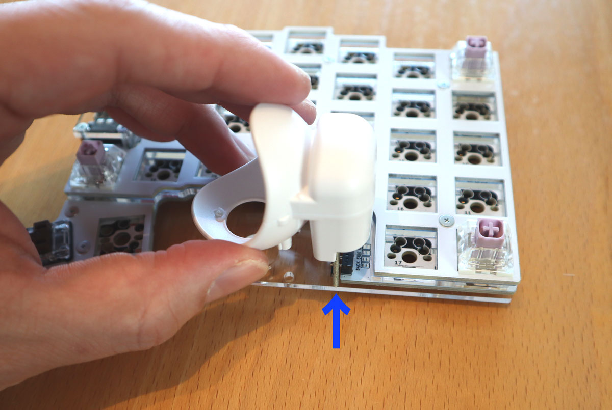

本体裏から確認するとメイン基板とボール基板の間に、矢印で示すような隙間が出来ている場合があります。

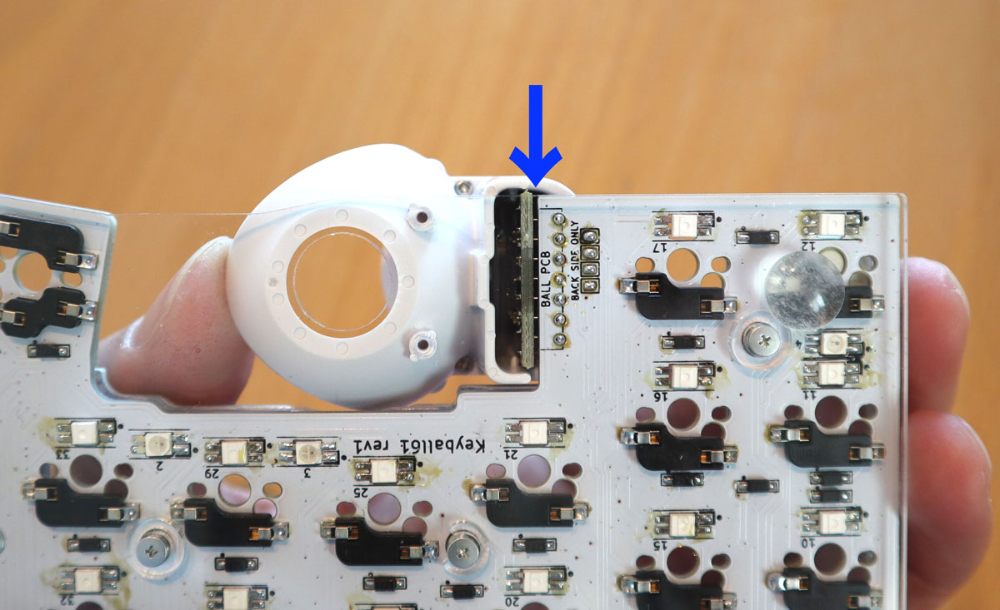

その時は、軽～くケース手前（指マークの方向）から押します。力を入れすぎるとL字コンスルーが破損する可能性があるので、軽く押してください。  
下写真のように隙間がなくなれば、青丸部のねじ穴が合うと思います。

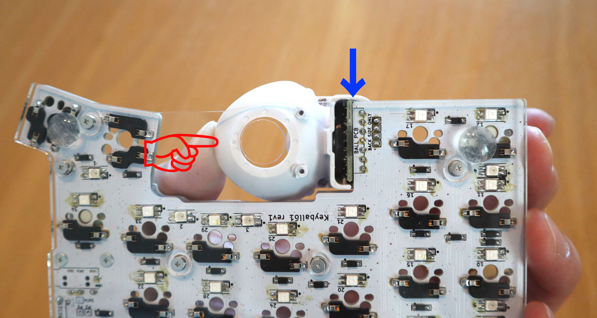

キットに同梱のM1.7トルクスねじの【頭が平らなねじ】２本を本体裏から絞めます。

この時ボール保持ケースが回転しないように指で抑えながらねじを絞めてください。

## ９．総仕上げ 

完成間近です！お好みのキースイッチをはめ込んでいきます。

最後に34mmトラックボールをケースに押し込んで完成です！  

お疲れ様でした。  

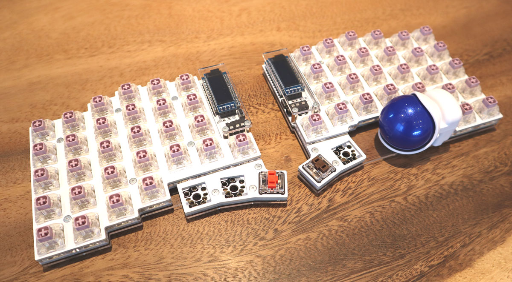

## １０．正規ファームウェアの書き込み 

それでは最後に正規のファームウェアをProMicroに書き込みましょう。

Keyball61は[REMAP](https://remap-keys.app/configure)に対応していますのでと特別なソフトをインストールしなくてもファームウェアの書き込みとキーマップの変更が可能です。REMAPの使用方法については[自キ温泉ガイドのサリチル酸](https://salicylic-acid3.hatenablog.com/entry/remap-manual)の記事に詳しく掲載されています。  

REMAPを使用するために下記のVIA対応ファームウェアを書き込んでください

   - Keyball61 VIA対応版ファームウェア [REMAPカタログのKeyball61ファームウェアページ](https://remap-keys.app/catalog/RZSU1CrvEW4lns0ww5BM/firmware)を開き、Keyball61_viaのファームウェアをFLASHしてください。

書き込みは[3-7章](#3-7promicroの書き込みと動作確認)でも書いた通り、FLASHボタンを押すと、書き込み方法の説明が表示されます。
USBケーブルを接続しているのにキーボードが認識されない場合は、半田付けしたRESETスイッチを素早く2回押すと認識されると思います。

※必ず左右両方のPro Microに同じhexファイルを書き込んでください。

■ご自身でファームウェアをビルドする場合  
Keyball61の最新ファームウェアは[Githubのリポジトリ](https://github.com/Yowkees/keyball/tree/main/qmk_firmware/keyboards/keyball)にて公開しています。このkeyballフォルダをお手持ちのQMK_Firmware/keyboardsへコピーして自由にキーマップ等を編集してmakeしてください。  

## １１．Keyballの使い方♪ 
   - トラックボールはレイヤー３に切り替わっている間は上下スクロールに変わります
   - [ReMAP](https://remap-keys.app/configure)に対応していますので、簡単にキーマップの確認・変更・書込みが可能です
   - USBケーブルは左右どちらに差しても使用できます。ただしキーマップはUSBケーブルを差した側のProMicroへ書き込まれるため、初めて差し替えた場合にはキーマップを見直してください
   - Keyballシリーズ用に特別に用意されたキーコードがレイヤー３に配置されています。トラックボールをスクロールに変化させたり、カーソル速度やスクロール速度変更に使用できます。

| キーコード | Remap上での表記 | 説明 |
|:-|:-|:-|
| `KBC_RST` | `0x5DA5` | Keyball設定のリセット |
| `KBC_SAVE` | `0x5DA6` | 現在のKeyball設定をEEPROMに保存します |
| `CPI_I100` | `0x5DA7` | CPIを100増加させます(最大:12000) |
| `CPI_D100` | `0x5DA8` | CPIを100減少させます(最小:100) |
| `CPI_I1K` | `0x5DA9` | CPIを1000増加させます(最大:12000) |
| `CPI_D1K` | `0x5DAA` | CPIを1000減少させます(最小:100) |
| `SCRL_TO` | `0x5DAB` | タップごとにスクロールモードのON/OFFを切り替えます |
| `SCRL_MO` | `0x5DAC` | キーを押している間、スクロールモードになります |
| `SCRL_DVI` | `0x5DAD` | スクロール除数を１つ上げます(max D7 = 1/128)←最もスクロール遅い |
| `SCRL_DVD` | `0x5DAE` | スクロール除数を１つ下げます(min D0 = 1/1)←最もスクロール速い |

以上でKeyball61のビルドガイドは終了です。
Keyball61についてのご質問や不具合等についてはGithubのリポジトリ、[Yowkees/keyballのDiscussions](https://github.com/Yowkees/keyball/discussions)へご投稿ください。なるべく早くご回答させていただきます。

―謝辞―  
Keyball61のファームウェアは、[KoRoN@香り屋様](https://www.kaoriya.net/)の多大なるご協力のおかげでトラックボールの動作が大幅にスムーズになったことに加え、メモリ容量の削減によりとてもたくさんのLEDアクションが楽しめます。トラックボール搭載とOLEDのために6本の信号線を消費しているにも関わらず、29キー搭載を実現するためにDuplex-Matrixを採用しましたが、そのファームウェアも開発いただきました。このような素晴らしいファームウェアを作成していただけたことにより、Keyball61の販売が実現しましたことをこの場を借りてお礼させていただきます。本当にありがとうございました。
　@Yowkees
